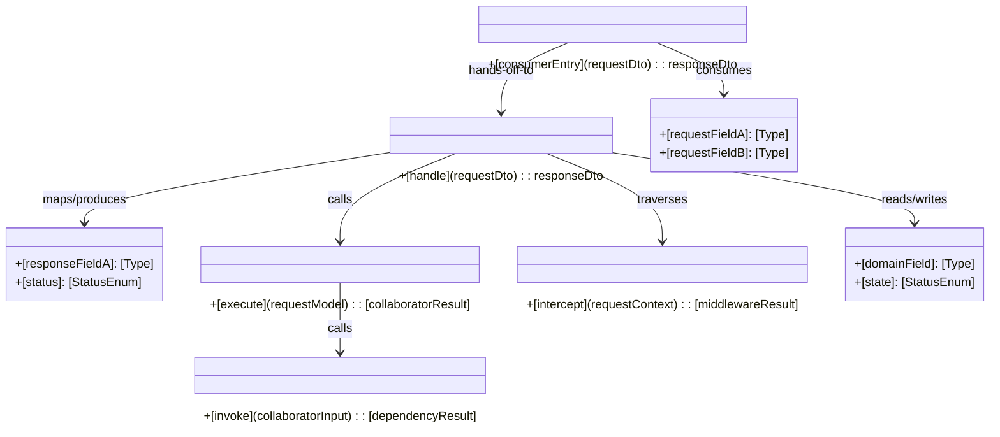
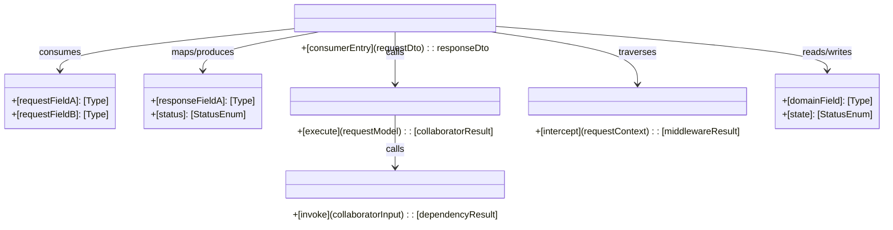
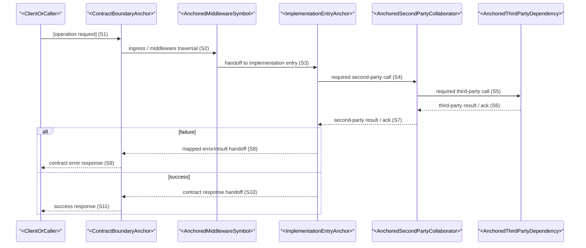
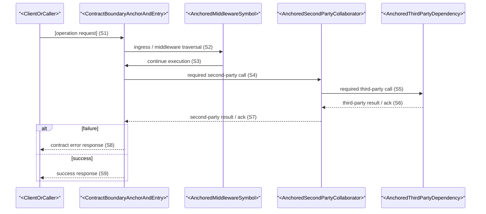

# Northbound Interface Design: [BINDING OR OPERATION]

**Stage**: Stage 3/4 Binding-Level Interface Design Closure
**BindingRowID (Required)**: [BR-###]
**Operation ID (Required)**: [operationId or N/A]
**IF Scope (Required)**: [IF-### or N/A]
**Boundary Anchor (Required)**: [HTTP `METHOD /path` \| `event.topic` \| `Facade.method` \| `cli command` \| `ConcreteBoundary.method` \| `TODO(REPO_ANCHOR)`]
**Anchor Status (Required)**: [`existing` \| `extended` \| `new` \| `contract-defined` \| `todo`]
**Implementation Entry Anchor (Required)**: [`path/to/file.ext::Symbol` \| `ConcreteEntry.method` \| `TODO(REPO_ANCHOR)`]
**Implementation Entry Anchor Status (Required)**: [`existing` \| `extended` \| `new` \| `contract-defined` \| `todo`]

This artifact is the single authoritative interface-design closure for one `BindingRowID`.
Its core outputs are fixed:

- `Interface Definition`
- `UML Class Design`
- `Sequence Design`
- `Test Projection`

## Northbound Entry Rules (Normative)

- Allowed normative boundary-anchor forms are exactly: HTTP `METHOD /path`, event topic `event.topic`, RPC/Façade method `Facade.method`, CLI `command`, concrete contract-defined boundary name `ConcreteBoundary.method`, or explicit `TODO(REPO_ANCHOR)`.
- `Boundary Anchor` MUST represent the first client-callable entry for this interaction, not an internal service/manager/mapper hop.
- If clients call an HTTP route directly, use HTTP `METHOD /path` as `Boundary Anchor` and the owning controller method as `Implementation Entry Anchor`.
- For HTTP-facing bindings, treat `Boundary Anchor` and `Implementation Entry Anchor` as two aligned views of one northbound boundary semantic: external consumer entry vs internal realization handoff.
- If clients call a stable RPC/Façade surface, use repo-backed `Facade.method` as `Boundary Anchor`.
- If both controller/HTTP and façade exist, select the consumer-visible first callable entry as normative `Boundary Anchor`.
- For first-party internal `contract-defined` anchors, prefer repository-style names such as `*Controller.method`, `*Service.method`, or `*ServiceImpl.method`; do not use `Facade` unless the anchor is explicitly modeling an adapter/external integration surface.
- `BA-*` labels are not valid normative boundary anchors.
- Apply anchor decision order `existing -> extended -> new(repo-backed) -> contract-defined(design-final)`.
- `extended` is valid only for same-entity field/state expansion.
- `new` is normative only when explicit `path::symbol` target evidence is provided.
- `contract-defined` is normative only when selected `spec.md` / `data-model.md` / `test-matrix.md` slices plus bounded repo reads fully close the binding design, but no repo-backed boundary/entry target can yet be confirmed.
- If neither repo-backed nor contract-defined target evidence is sufficient, set the corresponding anchor field to `TODO(REPO_ANCHOR)` and status to `todo`.

## Binding Context

Purpose: fix exactly which upstream requirement-projection unit this contract closes.
Keep this section locator-oriented; do not restate full upstream prose.

| Field | Value |
|-------|-------|
| `BindingRowID` | [BR-###] |
| `Operation ID` | [operationId or N/A] |
| `IF Scope` | [IF-### or N/A] |
| `UIF Path Ref(s)` | [UIF path refs] |
| `UDD Ref(s)` | [UDD refs or `N/A`] |
| `TM ID` | [TM-###] |
| `TC IDs` | [TC-###, TC-###] |
| `Test Scope` | [binding-scoped test coverage summary] |
| `Spec Ref(s)` | [UC / FR / UIF / UDD refs] |
| `Scenario Ref(s)` | [TM / SC refs] |
| `Success Ref(s)` | [success refs] |
| `Edge Ref(s)` | [edge / EC refs or `N/A`] |

## Interface Definition

This section is the contract authority for request/response shape and field-level semantics.
Generate it in this order:

1. `UDD Ref(s)` for user-visible field meaning
2. `data-model.md` for shared owner/source/lifecycle/invariant constraints
3. bounded repo evidence plus contract-defined closure evidence for landed naming and concrete shape

### Contract Summary

| Aspect | Definition |
|--------|------------|
| External Input | [behavior-significant external input surface] |
| Success Output | [contract-visible success output surface] |
| Failure Output | [contract-visible failure output surface] |
| Preconditions | [preconditions that must hold before execution] |
| Postconditions | [state/result guarantees after successful completion] |
| Visible Side Effects | [externally visible state change, event, or notification] |

### Shared Semantic Reuse

If the selected `BindingRowID` has no shared-semantic dependency, keep one explicit `N/A` row.

| Shared Semantic Ref | Constraint Type | Applied To | Impact on Contract |
|---------------------|-----------------|------------|--------------------|
| [`SSE-*` / `OSA-*` / `SFV-*` / `LC-*` / `INV-*` / `DCC-*` / `N/A`] | [`shared-semantic-element` / `owner-source-alignment` / `shared-field-vocabulary` / `lifecycle-invariant` / `downstream-contract-constraint` / `none`] | [request / response / owner field / behavior path / collaborator / `N/A`] | [what must be reused and what must not be invented locally] |

### Full Field Dictionary (Operation-scoped)

This is the only authoritative field-level contract surface for the operation.
It MUST cover request DTO fields, response DTO fields, and all owner/source fields that the operation reads, writes, projects, validates, defaults, or uses for state decisions.
Classify each row as `Dictionary Tier = operation-critical|owner-residual`; list `operation-critical` rows first.
Fields not used by this operation MUST remain listed with `Used in [operationId] = no`.
If a field cannot be fully confirmed, keep the row with an explicit gap marker rather than shrinking the contract.

| Field | Owner Class | Dictionary Tier | Direction | Required/Optional | Default | Validation/Enum | Persisted | Contract-visible | Used in [operationId] | Source Anchor |
|-------|-------------|-----------------|-----------|-------------------|---------|-----------------|-----------|------------------|-----------------------|---------------|
| [fieldPath] | [RequestModel / ResponseModel / StateOwner] | [`operation-critical` / `owner-residual`] | [input / output / state / derived] | [required / optional / conditional] | [default / derivation / none / gap] | [validation rule / enum vocabulary / gap] | [yes / no / derived / gap] | [yes / no / indirect] | [yes / no] | [`path/to/file.ext::Symbol` / `contract-defined field/method name` / `SSE-*` / `OSA-*` / `SFV-*` / `LC-*` / `INV-*` / `TODO(REPO_ANCHOR)`] |

## UML Class Design

This section MUST describe both class ownership and two-party package relation closure.

Mandatory rules:

- UML MUST cover `Boundary Anchor`, `Implementation Entry Anchor`, request/response models, key entity/value object ownership, and required collaborators.
- UML MUST include explicit two-party package relations; class-only diagrams are insufficient.
- Every sequence participant that is a first-party executable class/interface MUST appear in UML with at least one mapped method.
- For contract-visible request/response and behavior-significant fields, each field MUST have explicit UML ownership.
- Any newly introduced field/method/call not already in anchored sources MUST be explicitly marked as `new` or `contract-defined`.
- If `Boundary Anchor` / `Implementation Entry Anchor` are `contract-defined` but reuse an `existing` realization chain downstream, render both layers explicitly instead of replacing the design anchor with the nearest existing class.
- Any `contract-defined` entity/value object/state holder MUST identify owner, creator, reader, and writer closure somewhere in UML notes or field ownership rows before the artifact can be `done`.
- Angle-bracket labels in the examples below are template scaffolding only and MUST be replaced before the artifact can be `done`.

### Resolved Type Inventory

| Role | Concrete Name | Resolution | Source / Evidence | Notes |
|------|---------------|------------|-------------------|-------|
| [`boundary-entry` / `implementation-entry` / `request-dto` / `response-dto` / `entity` / `value-object` / `service` / `collaborator` / `middleware` / `external-dependency`] | [`path/to/file.ext::Symbol` or concrete contract-defined name] | [`existing` / `extended` / `new` / `contract-defined`] | [spec ref / data-model ref / repo anchor / contract-local rationale] | [why this concrete name is final for this contract run] |

Use `Notes` to make layering explicit whenever `contract-defined` and `existing` types coexist in the same design:

- mark northbound design anchors as `contract-defined boundary` / `contract-defined entry`
- mark reused downstream classes as `existing realization`
- mark any operation-scoped holder such as a new set/state/value object with owner + creator + reader + writer closure

### Class Diagram

#### UML Variant A (Boundary != Entry)

#### UML Variant B (Boundary == Entry)

### Two-Party Package Relations

This subsection is required.
Model the first-party package/module ownership and dependency direction explicitly.

| From Package | To Package | Relation Type | Covered Classes | Reason |
|--------------|------------|---------------|-----------------|--------|
| [package/module A] | [package/module B] | [`depends-on` / `calls` / `owns-model` / `crosses-boundary`] | [Boundary / Entry / DTO / Entity / Collaborator classes] | [why this 2-party package relation is required] |

## Sequence Design

This section MUST describe the executable call chain, including second-party, third-party, and middleware calls.

Mandatory rules:

- Sequence MUST start from consumer/client entry and reach `Implementation Entry Anchor` within the first two request hops.
- Sequence MUST be end-to-end contiguous: no broken hops, no orphan participants, and no disconnected request/response segments.
- Sequence MUST explicitly represent every mandatory second-party call on the main path.
- Sequence MUST explicitly represent every mandatory third-party call on the main path.
- Sequence MUST explicitly represent middleware traversal or middleware invocation points; do not collapse middleware into a silent internal step.
- Sequence MUST NOT merge multiple mandatory collaborators/dependencies into one synthetic participant label.
- When `contract-defined` boundary/entry anchors hand off to an `existing` realization chain, the first hop MUST remain the contract-defined anchor and the reused repo-backed chain MUST appear as a subsequent explicit handoff.
- Do not substitute the nearest `existing` controller/service for a `contract-defined` boundary when the new northbound interaction semantics are not identical.
- `opt` blocks are allowed only for truly conditional branches; mandatory main-path calls MUST remain outside `opt`.
- Main success path and key failure path MUST be traceable to `TM ID` / `TC IDs`.

### Behavior Paths

| Path | Trigger | Key Steps | Outcome | Contract-Visible Failure | Sequence Ref | TM/TC Anchor |
|------|---------|-----------|---------|--------------------------|--------------|--------------|
| Main | [Trigger] | [Essential interaction steps] | [Success outcome] | [N/A or failure mode] | [S1] | [TM-### / TC-###] |
| Failure | [Trigger / branch condition] | [Essential failure steps] | [N/A] | [Failure outcome] | [Sx] | [TM-### / TC-###] |

### Sequence Diagram

#### Sequence Variant A (Boundary != Entry)

#### Sequence Variant B (Boundary == Entry)

## Test Projection

This section is the normalized downstream testing slice for `/sdd.tasks` and `/sdd.implement`.
`Main Pass Anchor` and `Branch/Failure Anchor(s)` are generated here from `TM ID`, `TC IDs`, `Scenario Ref(s)`, `Success Ref(s)`, `Edge Ref(s)`, and the realized interface design.

### Test Projection Slice

| IF Scope | Operation ID | Test Scope | TM ID | TC ID(s) | Main Pass Anchor | Branch/Failure Anchor(s) | Command / Assertion Signal |
|----------|--------------|------------|-------|----------|------------------|--------------------------|----------------------------|
| [IF-### or N/A] | [operationId or N/A] | [`Contract` / `Integration` / `E2E` / `Mixed`] | [TM-###] | [TC-###, TC-###] | [primary success check inferred here] | [failure/branch checks inferred here] | [test command or assertion signal] |

### Cross-Interface Smoke Candidate

Keep exactly one row for the selected operation.
If this operation does not participate in feature-level smoke flow, keep `Candidate Role = none` with explicit `N/A` values.

| Smoke Candidate ID | IF Scope | Operation ID | Candidate Role | Depends On Candidate ID(s) | Trigger | Main Pass Anchor | Branch/Failure Anchor(s) | Command / Assertion Signal |
|--------------------|----------|--------------|----------------|----------------------------|---------|------------------|--------------------------|----------------------------|
| [SMK-###] | [IF-### or N/A] | [operationId or N/A] | [`entry` / `middle` / `exit` / `none`] | [SMK-###, SMK-### or `N/A`] | [cross-interface trigger or `N/A`] | [cross-interface success signal or `N/A`] | [degraded/failure signal or `N/A`] | [smoke command/assertion signal or `N/A`] |

## Closure Check

Keep this section short and explicit.

| Check Item | Required Evidence | Status |
|------------|-------------------|--------|
| Interface-definition closure | request/response surface + full field dictionary + shared semantic reuse are all present | [ok / gap] |
| UML closure | class diagram and two-party package relations both present and consistent with sequence | [ok / gap] |
| Sequence closure | success/failure paths include mandatory second-party, third-party, and middleware calls | [ok / gap] |
| Test closure | `TM/TC`, pass/failure anchors, and command/assertion signal are present | [ok / gap] |

## Upstream References

- `spec.md`: [canonical source for UC / FR / UIF / UDD / scenario refs]
- `test-matrix.md`: [TM / TC / scenario / success / edge refs captured above]
- `data-model.md`: [shared semantic elements, owner/source alignment, field vocabulary, lifecycle/invariant, downstream contract constraints]
- repo anchors: [boundary / entry / request-response model / collaborator / middleware / dependency symbols]

## Boundary Notes

- Keep field completeness in `Full Field Dictionary (Operation-scoped)`.
- Keep shared owner/source/lifecycle/invariant definitions upstream in `data-model.md`; reuse them here instead of re-declaring them.
- `contract` is responsible for first-time production of `Boundary Anchor`, `Implementation Entry Anchor`, request/response surface, UML closure, sequence closure, and test projection for this binding.
- If repo evidence is missing, this stage may design `new` repo-backed or `contract-defined` design-final operation-scoped boundary/entry/DTO/collaborator/middleware surfaces when they remain bounded to this binding.
- `contract-defined` anchors are planning-final for this binding and MUST stay concrete, uniquely named, and consistent across Interface Definition, UML, Sequence, and Test Projection.
- If `contract-defined` anchors reuse `existing` repo-backed implementation, keep the design anchor and reused realization chain distinct instead of collapsing both into one symbol.
- Any `contract-defined` operation-scoped holder/state class must close owner, creator, reader, and writer responsibilities before the binding can be treated as design-final.
- If a gap is truly shared-semantic, route upstream to `/sdd.plan.data-model`.
- Do not use helper docs (`README.md`, `docs/**`, `specs/**`, generated artifacts) as repo semantic anchors.
