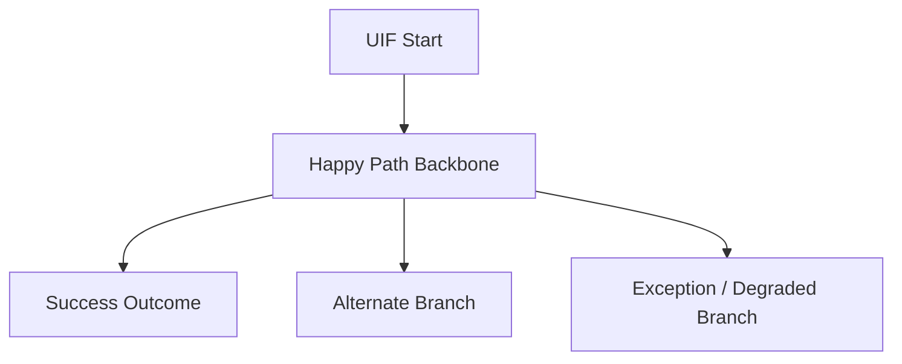

# Feature Verification Design: [FEATURE]

**Stage**: Stage 2 Feature Verification Design
**Inputs**: `spec.md`, bounded repo slice from `plan.md`

Use this artifact to derive stable northbound interface partitions and project verification semantics into stable binding packets.
`test-matrix.md` is authoritative for:

- interface partition decisions for the selected feature scope
- scenario-oriented test semantics
- stable `BindingRowID` generation from `spec.md`
- complete binding packets for selected bindings as downstream scope references

## Coverage Strategy

- [Coverage scope: which `UC / FR / UIF / UDD` paths must be verified and why]
- [Path decomposition: which happy / alternate / exception paths must stay distinct in test semantics]
- [Binding strategy: how spec paths collapse into stable `BindingRowID` units]
- [Observability strategy: which signals prove each path family]

## Interface Partition Decisions

Purpose: decide how many northbound interface units the selected feature slice requires before attaching TM/TC verification rows.

| BindingRowID | User Intent | Trigger Ref(s) | Request Semantics | Visible Result | Side Effect | Repo Landing Hint | Split Rationale |
|--------------|-------------|----------------|-------------------|----------------|-------------|-------------------|-----------------|
| BR-001 | [Northbound user intent] | [UIP / UIF / UC refs that trigger this action] | [Input semantics only; no DTO naming] | [Visible success/result semantics] | [Create / update / read / authorize / navigate / none] | [Existing entry family or bounded repo hint] | [Why this is one independent interface unit] |

Rules:

- Decide `BindingRowID` values from northbound action boundaries, not from page-state branches.
- Split rows only when user intent, request semantics, side effect, permission boundary, idempotency semantics, transaction boundary, or repo landing family materially differ.
- Do not split rows only because of happy / alternate / duplicate / timeout branches inside the same northbound action.
- `Repo Landing Hint` is a bounded reuse hint, not final contract closure.

## UIF Full Path Coverage Graph (Mermaid)

Purpose: spec-derived overview UIF completion for the selected feature scope. Integrate the consumer-visible UIF paths already defined inside relevant `UC` sections into one full-path interaction map from `spec.md`, not a repository realization or implementation sequence.

Rules:

- Derive this section only from `spec.md`.
- Use this section to complete the overview-level UIF by integrating the relevant `UC`-internal UIF paths into one replayable consumer-visible map.
- Use the happy path as the backbone of the full-path UIF.
- Add alternate, exception, or degraded branches only when they materially complete the consumer-visible path family defined in spec.
- Keep branch nodes aligned with the same path family unless the spec requires a different binding unit.
- Cite node or edge labels with the same `UIF Path Ref(s)`, `Scenario Ref(s)`, `Success Ref(s)`, and `Edge Ref(s)` used by the binding packet where relevant.
- Do not infer controllers, services, collaborators, DTOs, state owners, or repository hops here.
- Do not treat this diagram as interface design evidence; it exists only to make spec-defined interaction flow replayable during downstream reads.

## UIF Path Coverage Ledger

Purpose: enforce full selected-scope UIF path accounting for the coverage graph.

| UIF Path Ref | Path Type | Included in Graph | Omission Reason |
|--------------|-----------|-------------------|-----------------|
| [UIF-Path-001] | [Happy \| Alternate \| Exception \| Degraded] | [yes \| no] | [N/A when included; explicit reason when omitted] |

Rules:

- Every selected-scope `UIF Path Ref` MUST appear exactly once in this ledger.
- `Included in Graph = yes` means the path is explicitly rendered in `UIF Full Path Coverage Graph (Mermaid)`.
- `Included in Graph = no` is allowed only when omission keeps the graph readable and the path is still covered by `Scenario Matrix` / `Verification Case Anchors`.
- Any omitted path MUST provide a concrete omission reason (for example: duplicated by same-family branch compression, or visually equivalent terminal state).
- A path missing from both the Mermaid graph and this ledger is invalid.

## Scenario Matrix

Purpose: test semantics only; no interface-design closure.

| TM ID | BindingRowID | Path Type | Scenario | Preconditions | Expected Outcome | Related Ref |
|-------|--------------|-----------|----------|---------------|------------------|-------------|
| TM-001 | BR-001 | [`Happy` \| `Alternate` \| `Exception` \| `Degraded` \| `Duplicate` \| `Timeout`] | [Scenario summary] | [Required state/setup] | [Observable outcome] | [UC / UIF / FR / UDD / SC / EC refs] |

Rules:

- Keep rows minimal; add a new `TM ID` only when path semantics, preconditions, or expected outcomes materially differ.
- `Related Ref` should cite the spec evidence that makes the scenario necessary.
- `Scenario Matrix` rows may share one `BindingRowID`; scenario identity and binding identity are not the same thing.
- `BindingRowID` in this table MUST reuse the already-decided interface partition from `Interface Partition Decisions`.
- Do not redefine interface boundaries here; TM rows only attach verification paths to an existing binding.

## Verification Case Anchors

Purpose: verification goals and observable checks for each scenario unit.

| TC ID | BindingRowID | TM ID | Verification Goal | Observability / Signal | Related Ref |
|-------|--------------|-------|-------------------|------------------------|-------------|
| TC-001 | BR-001 | TM-001 | [What this case proves] | [Assertion, signal, or measurable check] | [SC / EC / FR / UIF / UDD refs] |

Rules:

- Keep `TC ID` stable and reusable across reruns.
- `Observability / Signal` should state what must be observed for the case to pass.
- Use multiple `TC ID` rows when one scenario needs separate observable guarantees.
- `BindingRowID` here MUST match the owning `TM ID` row and the interface partition decision.

## Binding Packets

Purpose: complete downstream scope-reference packet for the selected interaction unit.

| BindingRowID | IF Scope | User Intent | Trigger Ref(s) | Request Semantics | Visible Result | Side Effect | Boundary Notes | Repo Landing Hint | UIF Path Ref(s) | UDD Ref(s) | Primary TM IDs | TM IDs | TC IDs | Test Scope | Spec Ref(s) | Scenario Ref(s) | Success Ref(s) | Edge Ref(s) |
|--------------|----------|-------------|----------------|-------------------|----------------|-------------|----------------|-------------------|-----------------|------------|----------------|--------|--------|------------|-------------|-----------------|----------------|-------------|
| BR-001 | [IF-### or N/A] | [Northbound action summary] | [UIP / UIF / UC refs] | [Input semantics only; no DTO naming] | [Visible result semantics] | [Create / update / read / authorize / none] | [Idempotent / permission-gated / state-transitioning / N/A] | [Existing entry family or bounded repo hint] | [UIF path refs] | [UDD refs or `N/A`] | [TM-001] | [TM-001, TM-002] | [TC-001, TC-002] | [Binding-scoped test coverage summary] | [UC / FR / UIF / UDD refs] | [TM / SC refs] | [Success refs] | [Edge / EC refs or `N/A`] |

## Binding Projection Protocol (Required)

- Keep `TM ID`, `TC ID`, and `BindingRowID` stable once referenced downstream.
- One `BindingRowID` represents one consumer-visible northbound interface binding unit.
- A binding unit is uniquely determined by:
  - user intent / northbound action
  - `Trigger Ref(s)`
  - request semantics
  - visible result / side-effect semantics
  - bounded repo landing hint
- Merge happy / alternate / exception paths into one `BindingRowID` when they keep the same interaction family, requirement projection, and external contract intent.
- Express path differences through `TC IDs`, `Scenario Ref(s)`, `Success Ref(s)`, and `Edge Ref(s)` instead of minting a new binding row.
- Split into different `BindingRowID` values when any of these change materially:
  - user intent / northbound action boundary
  - request semantics
  - visible result or side-effect semantics
  - permission / idempotency / transaction boundary
  - repo landing family
- Do not emit a binding packet for pure internal steps that do not create an independent consumer-visible interface binding.
- Do not emit a new binding packet for a branch or exception path that still belongs to the same binding unit.
- Use `spec.md` as the semantic authority and bounded repo evidence only to confirm or separate interface units.

### Packet Field Semantics (Mandatory)

- `BindingRowID`: stable binding projection key; one row equals one downstream contract unit
- `IF Scope`: interface scope aligned to the same binding
- `User Intent`: concise statement of the northbound action this binding exists to serve
- `Trigger Ref(s)`: user-visible trigger refs that caused this interface partition
- `Request Semantics`: behavior-significant input semantics only; do not use DTO or class names
- `Visible Result`: the contract-visible result class of the binding from the user's perspective
- `Side Effect`: the externally meaningful state change, persistence, authorization, or transition effect; use `none` for read-only bindings
- `Boundary Notes`: lightweight notes about idempotency, permission, transaction, or state-transition characteristics that influenced the split
- `Repo Landing Hint`: bounded hint about the likely northbound entry family; not a final boundary anchor
- `UIF Path Ref(s)`: consumer-visible UIF path refs that define the interaction family
- `UDD Ref(s)`: data refs that materially affect this binding; use `N/A` when none apply
- `Primary TM IDs`: primary scenario rows that anchor the packet's main binding surface
- `TM IDs`: full scenario rows attached to the binding
- `TC IDs`: ordered verification case ids that belong to the same binding
- `Test Scope`: short statement of what behavior surface this packet must preserve
- `Spec Ref(s)`: authoritative `UC / FR / UIF / UDD` refs for this binding
- `Scenario Ref(s)`: scenario rows or spec scenario refs that materialize the packet
- `Success Ref(s)`: refs that prove expected main-path behavior
- `Edge Ref(s)`: refs that prove alternate / exception / degraded behavior

### Spec Slice Locator Rules (Mandatory)

- Treat every packet as a spec-slice locator, not as a prose summary of `spec.md`.
- `Spec Ref(s)` MUST identify the authoritative `UC / FR / UIF / UDD` ids that define the binding; do not restate their text here.
- `User Intent`, `Request Semantics`, `Visible Result`, `Side Effect`, and `Boundary Notes` are downstream scope references only; they do not replace contract design authority.
- `Trigger Ref(s)` MUST identify the user-visible triggers that justify this interface partition.
- `Repo Landing Hint` MUST stay at entry-family granularity; it must not name final controller/facade/DTO anchors.
- `UIF Path Ref(s)` MUST point to the exact consumer-visible path family that made this binding executable.
- `UDD Ref(s)` MUST point only to the data semantics actually needed for downstream design or shared-semantic alignment; do not copy unrelated data references.
- `Scenario Ref(s)`, `Success Ref(s)`, and `Edge Ref(s)` MUST be direct locator refs, not paraphrased outcome text.
- If a required spec slice cannot be located exactly, keep the gap explicit and block the packet rather than embedding a prose interpretation.

## Notes

- `test-matrix.md` first fixes interface partition decisions, then fixes the ref-level mapping from each binding to spec/test slices.
- `UIF Full Path Coverage Graph (Mermaid)` completes the spec overview UIF by integrating `UC`-local UIF paths into one replay aid for the same binding/test semantics, not a second implementation authority.
- `UIF Path Coverage Ledger` guarantees full selected-scope UIF path accounting even when the Mermaid graph intentionally compresses equivalent branches.
- Packets should remove rebinding work without duplicating `spec.md` prose.
- Downstream stages may consume these packets, but they must not rewrite `BindingRowID` or binding meaning.
