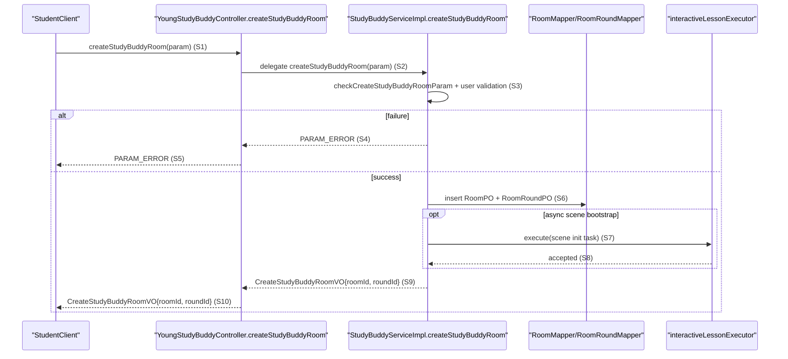
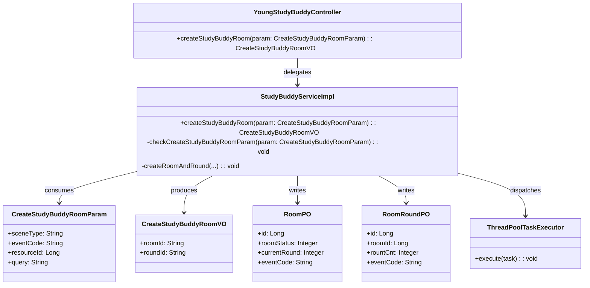

# Northbound Interface Design: YoungStudyBuddyController.createStudyBuddyRoom

**Stage**: Stage 3/4 Unified Interface Design
**Scope**: createStudyBuddyRoom interaction for entry-to-learning-room bootstrap
**IF Scope (Required)**: IF-UC001
**Operation ID (Required)**: OP-001
**Test Scope (Required)**: Integration
**Boundary Anchor (Required)**: YoungStudyBuddyController.createStudyBuddyRoom
**Anchor Status (Required)**: existing
**Implementation Entry Anchor (Required)**: aidm-web/src/main/java/com/jzx/aidm/controller/interactive/YoungStudyBuddyController.java::createStudyBuddyRoom
**Implementation Entry Anchor Status (Required)**: existing

This unified artifact is the single authoritative interface design unit for one binding row.
It combines:

- `Northbound Minimal Contract` (UIF + necessary UDD only)
- `Contract Realization Design` (delivery-level internal design needed for implementation and verification)

## Contract Binding

- Visible consumer / caller: 学生端字词学习客户端
- Client entry rationale: `YoungStudyBuddyController.createStudyBuddyRoom` is the first repo-visible northbound entry for this interaction and should appear before service-layer coordination.
- Entry-anchor rationale: Boundary and implementation resolve to the same controller method (`YoungStudyBuddyController::createStudyBuddyRoom`); service logic is a downstream collaborator rather than the contract entry itself.
- Southbound dependencies: `StudyBuddyService.createStudyBuddyRoom`, `RoomMapper.insert`, `RoomRoundMapper.insert`, `ThreadPoolTaskExecutor.execute` (async scene bootstrap), optional `StringRedisTemplate.opsForValue().set` in finish-flag path.

## Minimal Binding References

| Operation ID | Boundary Anchor | Operation / Interaction | IF Scope | Anchor Status | Repo Anchor | Implementation Entry Anchor | Implementation Entry Status | Upstream Ref(s) | Data Model Ref(s) |
|--------------|-----------------|-------------------------|----------|---------------|-------------|-----------------------------|-----------------------------|-----------------|-------------------|
| OP-001 | YoungStudyBuddyController.createStudyBuddyRoom | 创建学习房间并返回可学习上下文 | IF-UC001 | existing | aidm-web/src/main/java/com/jzx/aidm/controller/interactive/YoungStudyBuddyController.java::createStudyBuddyRoom | aidm-web/src/main/java/com/jzx/aidm/controller/interactive/YoungStudyBuddyController.java::createStudyBuddyRoom | existing | UC-001 / UIF-UC001-D01 / FR-001 / TM-001 / TC-001,TC-002 | N/A (packet does not require lifecycle anchor for this row) |

## Downstream Projection Input (Required)

### Spec Projection Slice

| IF Scope | Operation ID | UC Ref(s) | UIF Ref(s) | FR Ref(s) | Scenario Ref(s) | Success Criteria Ref(s) | Edge Case Ref(s) |
|----------|--------------|-----------|------------|-----------|-----------------|-------------------------|------------------|
| IF-UC001 | OP-001 | UC-001 | UIF-UC001-D01 | FR-001 | S1, S2 | S1 | EC-001 |

### Test Projection Slice

| IF Scope | Operation ID | Test Scope | TM ID | TC ID(s) | Main Pass Anchor | Branch/Failure Anchor(s) | Command / Assertion Signal |
|----------|--------------|------------|-------|----------|------------------|--------------------------|----------------------------|
| IF-UC001 | OP-001 | Integration | TM-001 | TC-001, TC-002 | TC-001 | TC-002 | 调用 `YoungStudyBuddyController#createStudyBuddyRoom`，断言 `roomId/roundId` 非空且返回学习会话上下文可继续 |

## Northbound Minimal Contract

### External I/O Summary

| Aspect | Definition |
|--------|------------|
| Request / Input (Necessary UDD Slice) | `CreateStudyBuddyRoomParam`: required `sceneType`, required `eventCode`; optional `resourceId`, `content`, `windowCode`, `messageId`, `live`, `dataId`, `type`, `query`, `imageUrl`, `ttsVersion` |
| Success Output (Necessary UDD Slice) | `CreateStudyBuddyRoomVO`: `roomId` (String), `roundId` (String), both generated from server IDs |
| Failure Output (Necessary UDD Slice) | `BizErrorCode.PARAM_ERROR` for null/invalid request (`sceneType`/`eventCode`) or unauthenticated user |

### Preconditions

- 调用方已完成登录态建立（`UserHelper.getUserId()` 非空）。
- `sceneType` 与 `eventCode` 必须是系统枚举中的合法值。

### Postconditions

- 新增 `RoomPO` 与 `RoomRoundPO` 持久化记录，并将房间状态置为 `OPEN`。
- 异步初始化任务已提交到线程池用于后续场景引导。

### Success Semantics

- 接口同步返回可用的 `roomId` 与 `roundId`，客户端可立即进入学习交互流程。

### Failure Semantics

- 输入不合法或用户未登录时，接口以参数错误语义失败，不产生成功响应体。

### Visible Side Effects

- 持久化学习房间与首轮会话。
- 某些听写事件码路径会写入短时完成标记（Redis）。
- 异步触发场景引导/AI 初始化流程。

## Contract Realization Design

### Field Semantics

| Field | Direction | Meaning | Required / Optional | Rules | Source |
|-------|-----------|---------|---------------------|-------|--------|
| `sceneType` | input | 指定业务场景分类 | required | 必须通过 `AIInvokeSceneTypeEnum.isCodeExist` 校验 | `CreateStudyBuddyRoomParam` + `checkCreateStudyBuddyRoomParam` |
| `eventCode` | input | 指定事件类型码 | required | 必须通过 `EventCodeEnum.isCodeExist` 校验 | `CreateStudyBuddyRoomParam` + `checkCreateStudyBuddyRoomParam` |
| `userId` | state | 当前登录用户标识 | required | 为空即失败（参数错误语义） | `UserHelper.getUserId` + `createStudyBuddyRoom` |
| `roomId` | output/state | 新建学习房间 ID | required | 由 `IdWorker.getId()` 生成并写入 `RoomPO.id` | `createStudyBuddyRoom` + `createRoomAndRound` |
| `roundId` | output/state | 新建首轮学习轮次 ID | required | 由 `IdWorker.getId()` 生成并写入 `RoomRoundPO.id` | `createStudyBuddyRoom` + `createRoomAndRound` |
| `RoomPO.roomStatus` | state | 房间生命周期状态 | required | 初始必须设置为 `RoomStatus.OPEN` | `createRoomAndRound` |
| `RoomRoundPO.rountCnt` | state | 当前轮次计数 | required | 首次创建固定为 `1` | `createRoomAndRound` |

### Behavior Paths

| Path | Trigger | Key Steps | Outcome | Contract-Visible Failure | Sequence Ref | TM/TC Anchor |
|------|---------|-----------|---------|--------------------------|--------------|--------------|
| Main | 学生首次进入字词学习并调用创建房间 | controller 接收请求 -> service 校验与建房 -> 提交异步初始化 | 返回 `roomId/roundId` 并可继续学习 | 参数非法或未登录导致失败 | S1-S10 | TM-001 / TC-001 |
| Branch | 学生非首次进入后再次调用创建房间 | 同主路径执行，但以历史学习上下文继续后续流程 | 返回新一轮可用会话上下文，历史连续性由后续场景数据保证 | 同主路径失败语义 | S1-S10 | TM-001 / TC-002 |

### Sequence Diagram

#### Sequence Variant B (Boundary == Entry)

### UML Class Design

#### UML Variant B (Boundary == Entry)

## Runtime Correctness Check

| Runtime Check Item | Required Evidence | Anchor | Status |
|--------------------|-------------------|--------|--------|
| Boundary-to-entry reachability | Consumer call lands directly on controller entry within first hop, then hands off to service collaborator | `YoungStudyBuddyController::createStudyBuddyRoom` (S1) -> `StudyBuddyServiceImpl::createStudyBuddyRoom` (S2) | ok |
| End-to-end chain continuity | Main/branch both follow contiguous S1->S10 chain | Behavior Paths Main/Branch + Sequence S1..S10 | ok |
| Behavior-path closure | TM/TC goals map to the contiguous controller-to-service main chain outcomes | `TM-001`, `TC-001`, `TC-002` + sequence | ok |
| Failure consistency | Validation/login failures map to failure output semantics through controller return path | `checkCreateStudyBuddyRoomParam`, `UserHelper.getUserId`, S4-S5 | ok |
| State-transition legality | Lifecycle invariants are not provided by selected packet for this row | Missing explicit lifecycle anchors in BR-001 packet | gap |
| Message callability | Every message is backed by callable methods/operations | `YoungStudyBuddyController`, `StudyBuddyServiceImpl`, `RoomMapper`, `RoomRoundMapper`, `ThreadPoolTaskExecutor` | ok |
| Field-ownership closure | Request/response and state fields have UML owners | `CreateStudyBuddyRoomParam`, `CreateStudyBuddyRoomVO`, `RoomPO`, `RoomRoundPO` | ok |
| Sequence-participant UML closure | All executable participants appear in UML | Sequence participants vs UML classes | ok |
| New-field/method call linkage | No new unanchored field/method/call introduced | Existing anchored symbols only | ok |

## Upstream References

- `spec.md`: UC-001, UIF-UC001-D01, FR-001, S1/S2, EC-001
- `test-matrix.md`: BR-001 packet, TM-001, TC-001, TC-002
- `data-model.md`: N/A for this binding packet (no mandatory lifecycle tuple projected)
- repo anchors:
  - `aidm-web/src/main/java/com/jzx/aidm/controller/interactive/YoungStudyBuddyController.java::createStudyBuddyRoom`
  - `aidm-service/src/main/java/com/jzx/aidm/studybuddy/service/impl/StudyBuddyServiceImpl.java::createStudyBuddyRoom`
  - `aidm-service/src/main/java/com/jzx/aidm/studybuddy/service/StudyBuddyService.java::createStudyBuddyRoom`
  - `aidm-service/src/main/java/com/jzx/aidm/service/param/studyBuddy/CreateStudyBuddyRoomParam.java`
  - `aidm-service/src/main/java/com/jzx/aidm/service/param/studyBuddy/CreateStudyBuddyRoomVO.java`

## Boundary Notes

- Keep northbound contract semantics minimal (`UIF` + necessary `UDD` slice only).
- Keep realization design delivery-oriented; avoid feature-wide architecture decomposition.
- Do not use helper docs (`README.md`, `docs/**`, `specs/**`, generated artifacts) as repo semantic anchors.
- Do not turn this artifact into an audit ledger.
