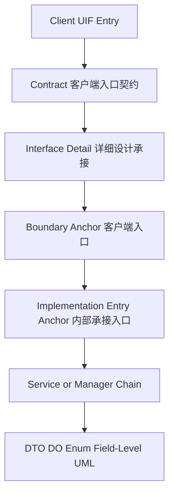

# Interface Detail / Contract 对齐整改计划

## 背景结论

基于用户澄清：

- [`templates/commands/plan.contract.md`](templates/commands/plan.contract.md) 产物应定位为 **面向 UIF 级别的客户端调用入口契约**。
- [`templates/commands/plan.interface-detail.md`](templates/commands/plan.interface-detail.md) 产物应定位为 **承接 contract 的详细设计**。

这意味着当前语义需要更明确地区分：

1. `contract` 负责定义客户端可见入口与外部 I/O 约束。
2. `interface-detail` 负责解释该入口在系统内部如何被承接、校验、编排、映射与失败传播。

## 现状问题

### 1. Contract 与 Interface Detail 的边界语义仍然偏重同一锚点

- [`templates/contract-template.md`](templates/contract-template.md) 当前将边界锚点限定为单一规范锚点，容易让 `contract` 与 `interface-detail` 共享同一入口视角。
- [`templates/interface-detail-template.md`](templates/interface-detail-template.md) 又要求 `Boundary Anchor` 必须与 Stage 3 contract 完全一致，导致详细设计难以自然展开到 controller / facade / service / manager 的承接链。

### 2. Interface Detail 的时序图容易退化为重复 contract

- 当前 [`Sequence Diagram`](templates/interface-detail-template.md:63) 虽允许展示协作者，但由于绑定 tuple 强制继承 contract 锚点，生成结果容易直接从 façade / API 开始，而不是从客户端入口一路承接到内部实现。
- 这会让详细设计缺少“入口如何落到内部职责链”的解释力。

### 3. UML 类图强调最小必要协作者，但未明确本接口承接全景

- 当前 [`UML Class Design`](templates/interface-detail-template.md:96) 偏向最小静态协作视图。
- 如果目标是承接 contract 完成详细设计，则需要更明确要求：
  - 覆盖本接口实际参与承接的关键类。
  - DTO / DO / 枚举至少达到字段级展示。
  - 体现字段来源、映射责任与失败归属。

### 4. 现有 lint 与测试尚未锁定上述语义

- 当前 [`rules/planning-lint-rules.tsv`](rules/planning-lint-rules.tsv) 只覆盖 `Boundary Anchor`、`Repo Anchor`、占位符符号与 `Contract Binding Row` 等基础约束。
- 当前 [`tests/test_plan_refactor_templates.py`](tests/test_plan_refactor_templates.py) 也尚未对客户端入口优先级、`Implementation Entry Anchor`、UML 字段级覆盖等新规则建立回归断言。

## 目标状态

### Contract 目标

[`templates/contract-template.md`](templates/contract-template.md) 应明确：

- 面向客户端 / 调用方。
- 对应 UIF 级交互入口。
- 描述客户端看到的请求、响应、失败、可见副作用。
- 不进入内部承接链细节。

### Interface Detail 目标

[`templates/interface-detail-template.md`](templates/interface-detail-template.md) 应明确：

- 以 contract 为输入。
- 详细说明该 contract 在系统内部如何落地。
- 时序图默认从客户端入口开始，贯穿 controller 或 façade 入口，再进入 service / manager / mapper 等必要协作者。
- UML 类图覆盖该接口落地所需关键类，并对关键 DTO / DO / 枚举给出字段级表达。

## 入口判定补充规则

### Contract 入口判定规则

[`templates/contract-template.md`](templates/contract-template.md) 与 [`templates/commands/plan.contract.md`](templates/commands/plan.contract.md) 应补充以下规则：

1. `contract` 的入口锚点优先表达 **客户端可见调用入口**，而不是内部第一跳实现类。
2. 当仓库存在 HTTP 路由 / controller 且客户端直接通过 HTTP 调用时：
   - `Boundary Anchor` 应优先落在 `HTTP METHOD /path`，必要时在正文中补充 repo-backed controller 方法。
   - 不应越过 controller 直接锚到 service / manager / mapper。
3. 当系统对客户端暴露的是 RPC / façade，而 controller 只是网关封装或根本不存在时：
   - `Boundary Anchor` 应落在 repo-backed [`Facade.method`](templates/contract-template.md:14)。
4. 若同一用例同时存在 controller 与 façade：
   - 以客户端实际感知的第一可调用入口作为 contract 的规范入口。
   - façade 作为内部承接链的一环进入 interface-detail，而不是反向替代 contract 入口。
5. 若 repo 中暂未存在稳定入口锚点：
   - 允许 `Repo Anchor = TODO(REPO_ANCHOR)`。
   - 但仍需先声明入口类型是 HTTP / RPC / event / CLI 中哪一类，避免 contract 漂浮到纯内部对象。

### Interface Detail 入口判定规则

[`templates/interface-detail-template.md`](templates/interface-detail-template.md) 与 [`templates/commands/plan.interface-detail.md`](templates/commands/plan.interface-detail.md) 应补充以下规则：

1. `interface-detail` 必须承接同一 contract tuple，但不等于只复述 contract 入口。
2. 新增一个内部承接字段，建议命名为 `Implementation Entry Anchor`，用于表达 contract 入口进入系统后，第一个承担业务承接职责的 repo-backed 入口。
3. `Implementation Entry Anchor` 的判定优先级：
   - 若客户端入口是 HTTP controller，且 controller 负责参数接收、鉴权、路由转发，则 `Implementation Entry Anchor = controller method`。
   - 若无 controller，客户端直接调用 façade / RPC，则 `Implementation Entry Anchor = facade method`。
   - 若 façade 仅为薄转发，而 service 才是第一个承接校验与编排的稳定入口，可在时序图中继续展开到 service，但不应跳过 controller / façade 的存在事实。
4. 时序图必须从客户端入口开始，并在前两跳内显式落到 `Implementation Entry Anchor`，之后再展开 service / manager / mapper。
5. 若 controller 与 façade 同时存在，时序图中两者都应出现，但规范绑定关系保持：
   - `Boundary Anchor = 客户端入口`
   - `Implementation Entry Anchor = 内部承接入口`

## UML 字段级覆盖补充规则

### 覆盖边界

[`templates/interface-detail-template.md`](templates/interface-detail-template.md) 中的 UML 规则建议从最小必要协作者升级为 **最小完整承接集**，具体为：

1. 必须覆盖本接口从入口到结果返回过程中承担以下职责的关键类：
   - 入口接收类，如 controller / façade。
   - 协调编排类，如 service / app service。
   - 领域或业务决策类，如 manager / domain service。
   - 直接影响 contract-visible 输出装配的 DTO / DO / VO / enum。
   - 直接决定失败语义的错误承载类或错误码枚举，若其在 repo 中可锚定。
2. 可省略以下对象：
   - 与本接口 contract-visible 结果无关的 util / helper。
   - 纯 ORM / schema / package 结构。
   - 不影响本接口输出与失败语义的缓存、监控、框架基类。
3. mapper / gateway 是否入图，以是否直接影响字段来源、可用性判断、推荐判断、失败分支为准；若影响则必须出现。

### 字段级展示深度

对 UML 中出现的类，建议按以下粒度展示：

1. **请求 DTO**：展示全部 contract 输入字段。
2. **响应 DTO**：展示全部 contract 输出字段；若存在嵌套 DTO，则嵌套对象也应展开至字段级。
3. **参与映射的 DO / Entity**：至少展示被本接口读取或写入的字段，不能只写类名。
4. **Enum / Status Vocabulary**：至少展示本接口涉及的取值集合或关键常量名。
5. **Manager / Service / Controller / Facade**：方法级为主；若类内字段承载关键依赖，可展示依赖字段。

### 字段级覆盖判定清单

每份 `interface-detail` 产物至少应满足：

- contract `Request / Input` 中出现的字段，在 UML 中都有归属类。
- contract `Success Output` 中出现的字段，在 UML 中都有归属类。
- [`Field Semantics`](templates/interface-detail-template.md:36) 中被赋予行为意义的字段，在 UML 中都能找到所有者。
- 时序图中出现并承担输出装配职责的类，在 UML 中可见。
- UML 中涉及的字段可以解释字段来自哪里、由谁决定、在何处被装配。

## 关键设计分歧待确认

### 方案 A

- `contract` 保持单一客户端入口锚点。
- `interface-detail` 继续复用该锚点作为绑定键。
- 但允许在详细设计中额外声明内部承接链起点。

优点：

- 对现有 `Binding Projection Index` 影响较小。
- 兼容现有 `Operation ID + Boundary Anchor + IF Scope` 绑定方式。

风险：

- 语义上仍可能混淆契约入口与内部承接入口。

### 方案 B

- `contract` 使用客户端入口锚点。
- `interface-detail` 新增独立字段，例如 `Implementation Entry Anchor` 或 `Runtime Entry Chain`。
- contract 仍提供绑定键，interface-detail 额外补充内部承接入口。

优点：

- 语义更清晰。
- 能同时满足客户端视角与详细设计视角。

风险：

- 需要改模板与生成逻辑。
- 可能波及校验规则与既有产物兼容性。

## 推荐方案

优先采用 **方案 B**：

- 保留 [`contract-template.md`](templates/contract-template.md) 的客户端契约绑定作用。
- 在 [`interface-detail-template.md`](templates/interface-detail-template.md) 中新增独立的内部承接字段 `Implementation Entry Anchor`。
- 将 `interface-detail` 的时序图和 UML 类图显式绑定到该内部承接字段。
- 用 lint 与测试把 controller / façade 判定规则、字段级 UML 覆盖规则固化下来。

这样可以同时满足：

- contract 作为 UIF 客户端入口。
- interface-detail 作为详细设计承接层。
- controller 与 façade 的分工可以同时表达，而不互相覆盖。
- UML 不再停留在抽象协作者名录，而能对字段来源与装配责任给出静态解释。
- 避免当前同一锚点既表示外部契约入口又表示内部详细设计入口的混用。

## 拟执行待办

- [ ] 在 [`templates/contract-template.md`](templates/contract-template.md) 中强化 UIF 客户端入口契约定位，加入客户端入口优先级与 controller / façade 选择规则。
- [ ] 在 [`templates/commands/plan.contract.md`](templates/commands/plan.contract.md) 中补充生成约束，要求优先选择客户端第一可调用入口，禁止直接下沉到 service / manager 作为 contract 入口。
- [ ] 在 [`templates/interface-detail-template.md`](templates/interface-detail-template.md) 中新增 `Implementation Entry Anchor`，用于承接 contract 到内部详细设计入口。
- [ ] 在 [`templates/interface-detail-template.md`](templates/interface-detail-template.md) 中重写时序图规范，要求时序图从客户端入口开始，并显式经过 controller / façade 判定后的内部承接入口。
- [ ] 在 [`templates/interface-detail-template.md`](templates/interface-detail-template.md) 中重写 UML 规范，将最小必要协作者细化为最小完整承接集，并增加 DTO / DO / enum 字段级覆盖要求。
- [ ] 在 [`templates/commands/plan.interface-detail.md`](templates/commands/plan.interface-detail.md) 中补充生成规则，禁止 `interface-detail` 仅复述 contract，必须解释内部承接链、字段映射来源与失败传播。
- [ ] 在 [`rules/planning-lint-rules.tsv`](rules/planning-lint-rules.tsv) 规划新增 lint 规则，校验 `interface-detail` 是否声明 `Implementation Entry Anchor`，以及 UML 是否至少包含关键 DTO / 输出字段级结构。
- [ ] 在 [`tests/test_plan_refactor_templates.py`](tests/test_plan_refactor_templates.py) 规划补充断言，锁定新增模板文案与命令约束，防止后续回退。
- [ ] 结合一个真实生成案例验证模板修订方向，确认时序图入口、controller / façade 选择、UML 字段级覆盖范围均满足预期。

## 实施分阶段建议

### 第 1 阶段

先修改 [`templates/contract-template.md`](templates/contract-template.md) 与 [`templates/interface-detail-template.md`](templates/interface-detail-template.md)，固化新的语义边界与新增字段。

### 第 2 阶段

修改 [`templates/commands/plan.contract.md`](templates/commands/plan.contract.md) 与 [`templates/commands/plan.interface-detail.md`](templates/commands/plan.interface-detail.md)，把入口判定规则与生成约束写进命令说明。

### 第 3 阶段

补充 [`tests/test_plan_refactor_templates.py`](tests/test_plan_refactor_templates.py) 中的字符串断言；如有必要，再为 [`rules/planning-lint-rules.tsv`](rules/planning-lint-rules.tsv) 规划新增 lint 规则。

### 第 4 阶段

以真实产物回放验证：检查 contract 是否锚定客户端入口，检查 `interface-detail` 是否明确内部承接入口，检查时序图是否完整经过 controller / façade，检查 UML 是否达到字段级覆盖。

## Mermaid 草图

