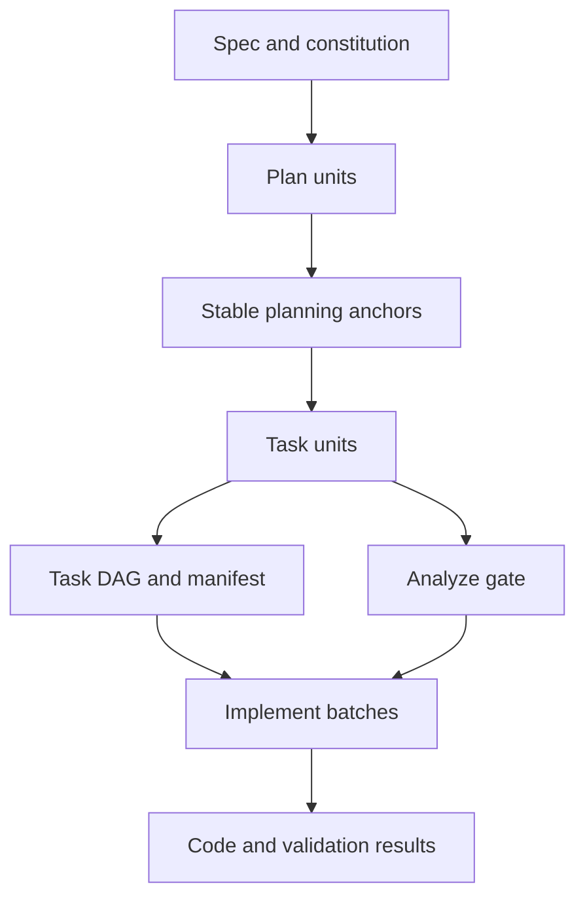

# `plan` / `tasks` / `implement` 大任务拆分方案

## 目标

将当前偏大的主线任务拆分为三个责任稳定、上下文受控、可逐层收敛的命令层：

- [`/sdd.plan`](../templates/commands/plan.md)
- [`/sdd.tasks`](../templates/commands/tasks.md)
- [`/sdd.implement`](../templates/commands/implement.md)

方案目标不是简单把流程切成三步，而是系统性解决以下问题：

- 执行时上下文过大
- 推理目标在中途漂移
- 下游阶段回补上游语义缺口
- 一个局部问题扩散成整个 feature 级偏移
- 运行中很难判断应该停止、返工还是继续

---

## 1. 问题定义

当前大任务带来执行偏移，根因通常不是任务数量多，而是责任边界不清：

1. 规划层没有冻结稳定锚点，就提前进入执行映射
2. 任务层除了做执行编排，还在补设计、补语义、补审计
3. 实现层本应消费任务图，却被迫重新理解乃至重写上游结论
4. 一个 feature 被当作单一执行单位，导致上下文不断累积

结合当前模板定义，仓库已经具备正确的责任方向：

- [`/sdd.plan`](../templates/commands/plan.md:23) 只负责生成规划产物与下游投影说明
- [`/sdd.tasks`](../templates/commands/tasks.md:62) 只负责把批准后的规划产物转为可执行 work package 与 DAG
- [`/sdd.implement`](../templates/commands/implement.md:77) 只负责消费任务运行时来源并执行，不回补新的规范语义
- [`/sdd.analyze`](../templates/commands/analyze.md:25) 是综合审计与实现前 gate 的集中入口

因此，设计重点应是把这四者之间的边界再明确化，并把大任务收敛成小而稳定的执行单元。

---

## 2. 设计原则

### 2.1 按责任边界拆，不按文档名拆

每层都只产出自己的投影，不替代上游权威语义：

- `plan` 产出规划压缩视图
- `tasks` 产出执行映射与 DAG
- `implement` 产出代码变更与执行状态
- `analyze` 产出综合审计与 gate decision

这与 [`docs/command-template-mapping.md`](../docs/command-template-mapping.md:155) 和 [`docs/command-template-mapping.md`](../docs/command-template-mapping.md:186) 中的职责声明一致。

### 2.2 按单活跃目标拆，不按 feature 整体推进

任一时刻只允许一个主生成目标活跃：

- 一个 blocker 包
- 一个 backbone object group
- 一组 tuple
- 一个 contract
- 一个 interface detail
- 一个 IF Scope 交付单元
- 一个 DAG-ready 执行批次

### 2.3 每层只读取当前单元所需的最小输入

该原则直接复用 [`/sdd.plan`](../templates/commands/plan.md:131) 的上下文压缩思路：

- Bootstrap packet
- Active workset
- Unit card

任何阶段都不应把完整 feature 全量装入活动上下文。

### 2.4 每层都必须有明确停止条件

无停止条件，就会自然滑向“先继续做，后面再修”。

必须把停止条件作为一等公民：

- `plan` 停止在语义不稳定处
- `tasks` 停止在执行不可调度处
- `implement` 停止在运行不可安全推进处

### 2.5 压缩后通过显式 handoff payload 传递，不传递全文上下文

按照当前 `plan -> tasks -> implement` 的执行方式，阶段推进不应再依赖隐式会话上下文，而应统一通过显式 `handoff payload` 传递：

- 当前单元完成后立刻压缩
- 丢弃本地详细工作集
- 只保留下游真正需要的稳定锚点
- 将这些稳定锚点连同允许读取范围、阻塞项、目标产物约束一起写入 `handoff payload`

### 2.6 `plan` 内部统一调度，不再额外拆出游离 handoff 指令

新的 `plan` 模型里，handoff 不再是 stage 之外的一段附属说明，而是 stage scheduler 的内建推进协议：

- 同一个 `plan` 内按执行时序推进 stage
- 每次 stage 推进都必须产出一个面向下一 stage 的 `handoff payload`
- 下一个 stage 只能消费 payload 中声明的最小上下文与权威输入
- 辅助文档不参与 stage 推进判定，也不作为 payload 证据来源

---

## 3. 总体拆分模型

建议将当前大任务改造成三层两次投影模型：

### 3.1 第一层：规划层

目标：在同一个 `plan` 调度器里，从规范语义收敛到稳定执行锚点，并通过 stage-local handoff payload 显式推进上下文。

输出不是“完整叙述”，而是：

- 已冻结的 canonical term
- 生命周期锚点
- 稳定 tuple keys
- contract bindings
- operation 级 interface details
- blocker 与 stop reason
- 面向下一 stage 或下一命令的 handoff payload

### 3.2 第二层：编排层

目标：从规划锚点投影成执行工作包与 Task DAG。

输出不是“重新设计”，而是：

- GLOBAL foundation
- IF Scope delivery units
- predecessor edges
- completion anchors
- `tasks.md`
- `tasks.manifest.json`

### 3.3 第三层：实现层

目标：从 DAG-ready 任务图收敛到代码与验证结果。

输出不是“补规范”，而是：

- 任务完成状态
- 代码改动
- 验证结果
- 阻塞说明
- 对上游修复的回指

---

## 4. 方法论方案

## 4.1 `plan` 层详细设计

### 4.1.1 角色定义

`plan` 负责把 feature 语义压缩成下游可复用的稳定锚点，但调度方式改为：

- 同一个 `plan` 内统一维护 stage scheduler
- 原本分散在命令外层的 handoff 指令并入 stage 推进协议
- 每个 stage 结束时显式生成 `handoff payload`
- 下一个 stage 只按 payload 声明的上下文窗口执行

换句话说，`plan` 不再依赖“上一段文字默认已经讲清楚”的隐式承接，而是把上下文交接本身变成一等输出。

### 4.1.2 统一 Stage Scheduler

按当前执行时序，建议把 `plan` 的运行统一成一个显式调度链：

1. Stage 0 `Shared Baseline Build`
2. Stage 1 `Artifact Workset Build`
3. Stage 2 `Target Dispatch`
4. Stage 3 `Single Artifact Generation`
5. Stage 4 `Compression and Downstream Handoff`

其中：

- Stage 0 与 Stage 1 对应第一次调用的索引构建
- Stage 2 到 Stage 4 对应第二次调用的目标产物生成与收尾
- `research.md`、`data-model.md`、`test-matrix.md`、`contracts/`、`interface-details/` 不再被视为一个必须整包串行生成的大 stage 链，而是由 Stage 3 根据 target entry 精确调度单个目标产物

这样可以把“先建索引、再生成单目标工件、最后对下游交接”统一成同一套 `plan` 内部状态机。

### 4.1.3 Stage 内最小执行单位

建议在 scheduler stage 之下进一步拆成更小的 planning units：

- P0 `Shared baseline packet`
- P1 `Artifact workset packet`
- P2 `Single target dispatch card`
- P3 `Single artifact generation card`
- P4 `Compression and downstream handoff card`

#### 单元粒度规则

- Stage 0：一次只收敛一份共享基线包
- Stage 1：一次只收敛一个目标工件对应的 workset
- Stage 2：一次只激活一个 target entry
- Stage 3：一次只生成一个目标工件
- Stage 4：一次只写出一个下游可消费 handoff payload

这与当前 `plan` 的单目标生成边界一致，只是把边界从“文字约束”提升为“调度协议”。

### 4.1.4 输入边界

`plan` 的输入应限制为：

- `spec.md`
- user input
- runtime constitution (`.specify/memory/constitution.md`; source mirror: `templates/constitution-template.md`)
- 目标性 repo anchors
- repository-first baseline，当某阶段确实需要时
- 上一 stage 产出的 `handoff payload`

不应在 `plan` 中预装：

- 完整历史产物
- 辅助文档检查结果
- 与当前 stage 无关的 contracts 或 details
- payload 未声明允许读取的额外上下文

这次新需求下，辅助文档不参与 `plan` stage 的推进判断，也不作为 payload 构造前提。

### 4.1.5 输出边界

`plan` 层的输出分为三类：

#### A. 索引阶段产物

- `Shared Baseline`
- `Artifact Workset`

#### B. 权威目标产物

- `data-model.md`
- `contracts/*`
- `interface-details/*`

#### C. 压缩与交接产物

- `plan.md`
- stage 级 `handoff payload`

其中 [`plan.md`](../templates/plan-template.md:10) 只能保留 planning summary，不得覆盖阶段权威产物；`handoff payload` 只承担上下文交接，不承担新的规范定义。

### 4.1.6 Stage 主循环

建议统一采用：

- Discover
- Generate
- Compress
- Handoff

其中：

- `Discover` 只读取当前 stage 所需的最小权威输入与上游 payload
- `Generate` 只生成当前 stage 对应的索引、目标工件或压缩账本
- `Compress` 只保留稳定锚点与最小阻塞信息
- `Handoff` 把这些结果封装成下一 stage 可消费的 payload

在 `plan` 内，`Compress` 和 `Handoff` 的组合输出只保留：

- 稳定术语
- 稳定 ID
- lifecycle anchors
- tuple keys
- contract bindings
- allowed read set
- target artifact contract
- downstream blockers

### 4.1.7 Handoff Payload 协议

建议把 `plan` 内部 stage 推进统一成以下 payload 结构：

- `from_stage`
- `to_stage`
- `target_entry`
- `goal`
- `authoritative_inputs`
- `allowed_reads`
- `write_target`
- `stable_anchors`
- `blockers`
- `stop_reason`
- `projection_notes`
- `aux_docs_checked: false`

约束如下：

- payload 必须显式声明“下一 stage 可以读什么，不能读什么”
- payload 只能引用权威输入或上一 stage 的稳定压缩结果
- payload 不能夹带全文推理、辅助文档摘要或隐式默认前提
- 如果 stage 因 blocker 停止，必须通过 payload 明确暴露停止原因，而不是让下游自行猜测

### 4.1.8 停止条件

当出现以下任一情况，当前 planning unit 必须停止：

- 缺失 repo anchor
- 生命周期状态未冻结
- tuple key 无法稳定对齐
- DTO 结构找不到锚点
- target entry 无法唯一解析
- payload 无法声明最小 allowed read set
- contract 需要依赖未完成的 interface semantics
- repository-first baseline 缺失、过时或不可追溯

停止后不应强行生成“近似版本”，而应显式写出 blocker payload。

### 4.1.9 成功标准

一个 `plan` 单元完成，必须满足：

- 输入边界明确
- 输出边界明确
- 只生成当前单元对应产物
- 已生成可供下一 stage 消费的 handoff payload
- payload 不泄漏未声明上下文
- 压缩结果足够支持下一阶段
- 不把 `TODO(REPO_ANCHOR)` 升格成稳定语义

---

## 4.2 `tasks` 层详细设计

### 4.2.1 角色定义

`tasks` 只做执行映射，不做再设计。

依据 [`docs/command-template-mapping.md`](../docs/command-template-mapping.md:157)，它的职责是：

- executable work mapping
- Task DAG synthesis
- manifest projection

### 4.2.2 最小执行单位

建议把 `tasks` 拆成以下单元：

- T0 `GLOBAL foundation`
- T1 `IF-001 delivery unit`
- T2 `IF-002 delivery unit`
- T3 `IF-003 delivery unit`
- T-final `Final DAG assembly and manifest projection`

关键规则：

- 一个 IF Scope 就是一个任务生成单元
- 不允许同时活跃多个 IF Scope
- `GLOBAL` 只容纳真正跨接口共享的基础任务
- 不能把 interface-local 工作塞进 `GLOBAL`

### 4.2.3 输入边界

根据 [`templates/commands/tasks.md`](../templates/commands/tasks.md:84)，输入应为：

- `plan.md`
- `spec.md`
- `data-model.md`
- `test-matrix.md`
- `contracts/`
- `interface-details/`
- 必要时的 `research.md`
- repository-first canonical baseline

但对活动单元的实际读取必须是最小切片，而不是全量重放。

### 4.2.4 输出边界

`tasks` 的合法输出只有：

- `tasks.md`
- `tasks.manifest.json`
- 执行摘要

不允许输出新的权威语义定义，不允许回写：

- 新 contract 语义
- 新 lifecycle stable states
- 新 invariant
- 新 boundary semantics

### 4.2.5 主循环

建议固定为：

- Discover
- Generate
- Compress

与 [`templates/commands/tasks.md`](../templates/commands/tasks.md:101) 一致。

#### Discover

只找活动单元所需的最小 authoritative slices：

- 当前 IF Scope 对应 contract slices
- 当前 IF Scope 对应 detail slices
- 匹配的 `TM-*` / `TC-*`
- 必要的 `data-model` anchors
- 必要的 `spec` refs

#### Generate

只生成当前单元所需：

- task lines
- local predecessor edges
- target paths
- completion anchors
- refs

#### Compress

只保留：

- `IF Scope`
- `operationId`
- `Boundary Anchor`
- task ids
- local edges
- completion anchors
- blockers

### 4.2.6 `Validate` 的重新定义

参考 [`plans/tasks-runtime-optimization-plan.md`](./tasks-runtime-optimization-plan.md:128)，建议把 `Validate` 从主循环中移除，改成单元间或收尾阶段的最小硬门禁。

允许保留在 `tasks` 的检查：

- 输入存在性
- tuple 对齐是否可执行
- task 行是否有明确目标
- predecessor edge 是否可解析
- DAG 是否可调度
- manifest 与 `tasks.md` task id 是否对齐

必须迁移到 [`/sdd.analyze`](../templates/commands/analyze.md:41) 的检查：

- coverage completeness
- ambiguity sweep
- terminology drift
- repo-anchor misuse
- helper-doc leakage
- cross-artifact contradiction
- audit hygiene

### 4.2.7 停止条件

当出现以下情况时，`tasks` 必须停止当前作用域：

- contract 已有，但必需 interface detail 缺失
- tuple 无法对齐到唯一 IF Scope
- required baseline 缺失或不可信
- ready task 无法形成明确 completion anchor
- predecessor edge 存在闭环或不可解依赖
- 单元任务需要引入新的上游设计结论

### 4.2.8 成功标准

一个 IF Scope 任务单元完成时，必须满足：

- 只消费该 IF Scope 的权威语义
- 输出至少一组可执行 work package
- 依赖边局部可解释
- completion anchor 可验证
- 结果可被最终 DAG 合成复用

---

## 4.3 `implement` 层详细设计

### 4.3.1 角色定义

`implement` 只消费现成的执行计划，不补设计。

这与 [`templates/commands/implement.md`](../templates/commands/implement.md:155) 中的执行边界一致。

### 4.3.2 最小执行单位

建议把实现阶段拆成 DAG-ready runtime batches：

- I0 `Runtime source and DAG load`
- I1 `GLOBAL ready layer`
- I2 `IF-001 ready layer`
- I3 `IF-002 ready layer`
- I4 `IF-003 ready layer`
- I-final `Cross-interface finalization`

如果单层过大，再细分为无文件冲突集合：

- I2.1 `IF-001 Verify`
- I2.2 `IF-001 Interface`
- I2.3 `IF-001 Domain or Service`
- I2.4 `IF-001 Validation`

### 4.3.3 输入边界

根据 [`templates/commands/implement.md`](../templates/commands/implement.md:103)，优先输入为：

- `tasks.manifest.json`
- `tasks.md`
- `plan.md`
- 按需读取的 supporting artifacts

关键约束：

- 运行图每次执行只解析一次
- 后续只复用内存图，不重复全量 markdown parsing
- supporting artifacts 只为 ready task 服务

### 4.3.4 输出边界

实现阶段只能输出：

- 代码改动
- 已完成任务状态
- 局部验证结果
- blocked / skipped 说明
- 需要返工的上游指向

不得输出：

- 新 contract 规范
- 新 lifecycle 定义
- 新 invariant
- 新 repo-anchor 语义

### 4.3.5 执行模式

#### strict

- 严格按 `Task DAG` 执行
- 不改变任务分解
- 只做描述性执行摘要

#### adaptive

- 允许安全前提下的局部 split / merge / resequence
- 但必须保持 lineage 可追踪
- 不得突破 dependency safety
- 不得引入新规范语义

### 4.3.6 停止条件

任一情形出现即停止或阻塞当前分支：

- required artifact 缺失
- runtime source 不可消费
- DAG 无法安全调度
- ready task 所需输入缺失
- 与权威 artifact 发生无法安全解决的冲突
- runtime drift 超出 local adaptation 安全界限

### 4.3.7 成功标准

一个 implement batch 完成，必须满足：

- batch 内任务依赖已闭合
- 无未申明的文件冲突
- completion anchors 已验证
- `tasks.md` 复选框与执行状态一致
- 若有 adaptation，能追溯到源 task id

---

## 5. 跨层门禁体系

建议引入三层门禁，而不是一个大一统 gate。

## 5.1 规划门禁

负责判断是否允许从 `plan` 进入 `tasks`：

- 稳定 tuple 是否齐备
- lifecycle anchors 是否冻结
- contract 与 detail 是否具备最小下游可消费性
- blocker 是否显式化
- 是否仍存在 `TODO(REPO_ANCHOR)` 被错误升级

## 5.2 编排门禁

负责判断是否允许从 `tasks` 进入 `analyze` 与 `implement`：

- task 行是否完整可执行
- DAG 是否安全
- manifest 是否与 `tasks.md` 对齐
- IF Scope 是否全部形成可消费单元

## 5.3 实施门禁

负责判断是否允许某 ready batch 真正运行：

- required source 是否存在
- 依赖是否闭合
- 阻塞输入是否缺失
- 文件冲突是否可避免
- analyze gate 是否已通过或被明确接受

---

## 6. 上下文压缩策略

该方案成立的关键是上下文收敛，而不是仅靠文档分层。

## 6.1 三层上下文

建议三层统一采用以下模型：

- `Bootstrap packet`
- `Unit workset`
- `Task or unit card`

### Bootstrap packet

保留整个运行的最小共享信息：

- feature id
- branch
- feature goal
- 当前阶段可用 artifact inventory
- constitution hard constraints
- repository-first baseline availability

### Unit workset

只保留当前单元必需切片：

- 当前 IF Scope 的 contract rows
- 当前 operation 的 detail sections
- 当前 batch 的 task metadata

### Task or unit card

只保留单一活跃目标：

- 一个 planning unit
- 一个 IF delivery unit
- 一个 ready execution batch

## 6.2 压缩输出与 handoff payload 规范

每个单元完成后，只通过 `handoff payload` 传递下游稳定信息：

- stable IDs
- refs
- anchors
- blockers
- edges
- target paths
- completion anchors
- allowed read set

不传递：

- 完整 prose
- 历史 reasoning 全文
- 已经过时的 derived summaries
- 辅助文档检查结论

---

## 7. 可观测指标设计

要验证拆分是否真正降低上下文与推理复杂度，建议加入以下观测项。

## 7.1 单元规模指标

- 每个 `plan` 单元允许读取的权威输入文件数上限
- 每个 `tasks` 单元允许活跃的 tuple 数上限
- 每个 `implement` batch 允许的 task 数上限

## 7.2 依赖复杂度指标

- 单 task 最大 predecessor fan-in
- 单 IF Scope 对外部 GLOBAL 的依赖数
- DAG ready layer 的平均共享文件冲突数

## 7.3 漂移指标

- implement 阶段触发上游返工次数
- tasks 阶段因缺 detail 停止次数
- plan 阶段因 repo-anchor 缺失停止次数
- adaptive 模式下 split / merge / resequence 次数

## 7.4 稳定性判据

当出现以下结果时，可判断方案开始收敛：

- implement 中补设计的情况显著减少
- 单次阻塞集中在单个 IF Scope 或单个 operation
- GLOBAL 区域规模稳定，不再持续膨胀
- analyze 的发现逐步集中于局部问题而非系统性污染

---

## 8. 当前仓库的落地改造方案

## 8.1 现有基础判断

仓库已经具备较好的职责基础：

- [`templates/commands/plan.md`](../templates/commands/plan.md:103) 已经定义了清晰的 stage I O 边界
- [`templates/commands/plan.md`](../templates/commands/plan.md:131) 已经定义了 runtime context minimization
- [`templates/commands/tasks.md`](../templates/commands/tasks.md:77) 已经把 `GLOBAL -> 单 IF Scope -> DAG assembly` 确认为主线
- [`templates/commands/implement.md`](../templates/commands/implement.md:87) 已经把 implement 的 hard pre-execution gates 缩小到执行视角
- [`templates/commands/analyze.md`](../templates/commands/analyze.md:117) 已经承担集中语义审计职责
- [`docs/command-template-mapping.md`](../docs/command-template-mapping.md:157) 已对 `tasks` 与 `analyze` 的职责边界给出明确说明

这意味着不需要重建框架，重点是进一步收敛和制度化。

## 8.2 落地改造目标

### 目标 A：把 `plan` 的单元化模型与内部调度进一步显式化

当前 [`templates/commands/plan.md`](../templates/commands/plan.md:139) 已经包含单元化思想，但还可以进一步强化：

- 强调 stage scheduler 是 `plan` 内建机制
- 强调 Stage 内的最小生成单元
- 强调 blocker 与 stop condition 的显式记录
- 强调 `plan.md` 只保留下游稳定投影
- 强调 stage 推进必须生成显式 `handoff payload`

### 目标 B：继续瘦身 `tasks`

参考 [`plans/tasks-runtime-optimization-plan.md`](./tasks-runtime-optimization-plan.md:37)，建议继续：

- 保持 `Discover -> Generate -> Compress`
- 将 `Validate` 彻底降为最小硬门禁
- 继续把综合审计责任明确留给 [`/sdd.analyze`](../templates/commands/analyze.md:41)

### 目标 C：让 `implement` 真正只执行 runtime graph

当前 [`templates/commands/implement.md`](../templates/commands/implement.md:147) 已提出 single-parse rule，可继续强化：

- batch 执行粒度
- file conflict aware 的 ready layer 划分
- adaptive 模式的明确边界
- 上游返工触发条件的标准化

### 目标 D：把 handoff 协议内化为 `plan` 的 stage 推进协议

建议把原本分散的 handoff 指令并入 `plan` 内部 stage scheduler，并统一成标准 payload：

- 上游产物路径
- 稳定 anchor 集合
- blocker 集合
- stop condition 触发说明
- allowed read set
- 下一 stage 或下一命令可消费范围
- `aux_docs_checked: false`

### 目标 E：本轮落地不把辅助文档检查作为前置条件

这轮改造先收敛主命令调度协议本身：

- 不要求先检查辅助文档
- 不要求辅助文档先完成同步
- 只要命令模板、payload 协议、消费边界与测试约束闭合即可推进

---

## 8.3 建议修改点

### 修改点 1：增强 [`templates/commands/plan.md`](../templates/commands/plan.md:1)

建议新增或强化的内容：

- `plan` 内部 stage scheduler 定义
- Stage 内最小单元定义
- 每单元输入上限与活动上下文规则
- stage 间 `handoff payload` schema
- 每阶段的显式 stop condition
- `plan.md` downstream projection 的字段建议

目标：让 `plan` 更像一个带显式交接协议的稳定锚点生产器，而不是“大而全的设计草稿器”。

### 修改点 2：继续收敛 [`templates/commands/tasks.md`](../templates/commands/tasks.md:1)

建议明确：

- `GLOBAL` 的严格适用范围
- 一个 IF Scope 就是一个 delivery unit
- 不允许跨 IF Scope 混合生成主任务包
- hard gates 与 analyze concerns 的边界文字再强化
- `tasks.manifest.json` 只投影 runtime metadata，不得引入新语义

### 修改点 3：增强 [`templates/commands/implement.md`](../templates/commands/implement.md:1)

建议明确：

- ready layer 与 batch 的定义
- 文件冲突优先于并行机会
- local adaptation 的许可动作与禁止动作
- drift 触发返工的标准语句
- 仅允许消费 upstream authoritative semantics

### 修改点 4：按需补强 [`docs/command-template-mapping.md`](../docs/command-template-mapping.md:155)

这项不再作为本轮前置条件，只在主命令协议稳定后按需补充：

- `plan` 的单元化规划职责
- `plan` 内部 scheduler 与 payload handoff 关系
- `tasks` 的 IF Scope execution package 概念
- `implement` 的 batch execution 概念
- `analyze` 作为综合 gate 的前置位置

### 修改点 5：补充测试与防回退约束

建议增加测试方向：

- `tasks` 不再吸收 audit 职责
- `implement` 不回补 design semantics
- manifest 与 `tasks.md` 对齐
- 单个 IF Scope 缺 detail 时能正确 stop
- analyze-first gate 的提醒仍存在

---

## 8.4 推荐实施步骤

### 阶段 1：文案与边界收敛

目标：先把命令职责与停止条件写清楚。

本轮不以辅助文档同步或检查完成作为 gate。

步骤：

- 先调整 [`templates/commands/plan.md`](../templates/commands/plan.md:1) 的 stage scheduler 与 payload 协议
- 再调整 [`templates/commands/tasks.md`](../templates/commands/tasks.md:1) 与 [`templates/commands/implement.md`](../templates/commands/implement.md:1) 的 payload 消费边界
- 最后再决定是否同步更新 [`docs/command-template-mapping.md`](../docs/command-template-mapping.md:155)

### 阶段 2：测试兜底

目标：防止未来责任回流。

步骤：

- 为 `tasks` 的 scope guard 增加测试
- 为 `implement` 的 no-new-semantics 增加测试
- 为 analyze-first 提醒增加测试
- 为 manifest 与 task ids 对齐增加测试

### 阶段 3：运行时细化

目标：在不改变权威模型的前提下优化执行体验。

步骤：

- 细化 ready layer 摘要
- 细化 file conflict hints
- 评估轻量内存态 derived views
- 评估脚本级前置检查开销

---

## 9. 风险与应对

### 风险 1：拆分过细导致用户感知流程变长

应对：

- 保持命令数量不变
- 只缩小内部执行单元
- 对外仍维持 `plan -> tasks -> analyze -> implement` 主线

### 风险 2：`GLOBAL` 继续膨胀

应对：

- 明确 `GLOBAL` 只允许跨接口共享基础项
- 任何能归属 IF Scope 的任务都禁止落入 `GLOBAL`

### 风险 3：`implement` 在 adaptive 模式下重新吸收设计职责

应对：

- 明确 adaptive 只允许局部调度适配
- 所有新语义一律回指上游修复

### 风险 4：派生缓存被误用为权威来源

应对：

- 强调 derived view 仅用于运行时导航
- 保持 `tasks.manifest.json` 的投影定位不变
- 冲突时一律回到权威 artifact

---

## 10. 建议 Todo 列表

- [ ] 明确 [`/sdd.plan`](../templates/commands/plan.md) 的 Stage 内最小生成单元与 stop condition
- [ ] 明确 [`/sdd.plan`](../templates/commands/plan.md) 的 stage scheduler 与 `handoff payload` schema
- [ ] 明确 [`/sdd.tasks`](../templates/commands/tasks.md) 的 `GLOBAL` 与单 `IF Scope` 边界
- [ ] 将 [`/sdd.tasks`](../templates/commands/tasks.md) 的检查进一步收敛到 execution-safe hard gates
- [ ] 明确 [`/sdd.implement`](../templates/commands/implement.md) 的 DAG-ready batch 与 adaptive 边界
- [ ] 明确 `tasks` / `implement` 如何消费 `plan` 传出的 handoff payload
- [ ] 评估是否还需要同步更新 [`docs/command-template-mapping.md`](../docs/command-template-mapping.md) 的职责说明
- [ ] 增加针对 scope drift、audit 回流、manifest 对齐、analyze-first handoff 的测试
- [ ] 在一次小范围样例 feature 上验证拆分后是否显著减少 implement 阶段的上游返工

---

## 11. 结论

这套方案的核心不是把一个大任务机械分成三步，而是把每一步进一步拆成“可停止、可压缩、可交接”的小单元，并把交接协议内化到 `plan` 的 stage 调度里：

- `plan` 按 `scheduler stage + 单 target card` 拆，并通过 `handoff payload` 推进
- `tasks` 按 `GLOBAL + 单 IF Scope` 拆
- `implement` 按 `DAG-ready + 无文件冲突 batch` 拆

这样做后：

- 上下文体积会稳定缩小
- 推理复杂度会从 feature 级耦合下降到 unit 级闭环
- 漂移会被限制在单个 operation、单个 IF Scope 或单个 batch 内
- `analyze` 会重新成为唯一的综合审计入口
- `implement` 会更接近真正的执行器，而不是补设计器

最终目标不是消灭所有阻塞，而是把阻塞局部化、显式化、可回指化，从而避免整个主线流程被一次偏移拖散。
