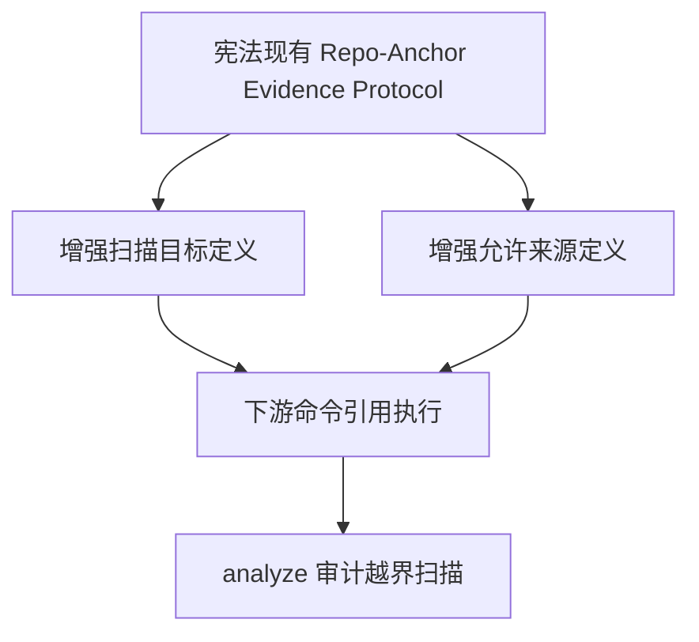

# `sdd` 全局源码扫描边界修正计划

## 修正后的结论

上一版方案的问题是把宪法承接点选错了，也把工程文件白名单收得过死。

这次应基于现有的 [`Repo-Anchor Evidence Protocol`](../templates/constitution-template.md#repo-anchor-evidence-protocol) 做增强，而不是回到抽象的 [`Repository-First Principle`](../templates/constitution-template.md) 去重新定义一层。

原因很明确：

- 当前宪法模板在 [`templates/constitution-template.md`](../templates/constitution-template.md#repo-anchor-evidence-protocol) 已经直接规定 repo semantic anchors 的来源边界
- 当前宪法模板在 [`templates/constitution-template.md`](../templates/constitution-template.md#repo-anchor-evidence-protocol) 已经存在 whitelist 结构
- 这次要修的不是 是否仓库优先，而是 仓库分析到底该扫描什么，才能得出正确的依赖矩阵、组件能力边界、源码目录结论

因此，正确方向应是：

- 在现有 [`Repo-Anchor Evidence Protocol`](../templates/constitution-template.md#repo-anchor-evidence-protocol) 中增强扫描目标与允许来源
- 下游 `sdd` 命令统一引用这个协议执行
- [`templates/commands/analyze.md`](templates/commands/analyze.md) 负责审计越界扫描与错误锚点提升

## 必须锁定的仓库分析目标

根据你的反馈，仓库扫描不是泛泛读取仓库，而是为了锁定以下核心结论：

1. 依赖矩阵
2. 组件能力边界
3. 源代码目录

这意味着扫描边界的定义不能只写成 只看某一个构建文件，也不能放宽成 整仓任意读取，而必须围绕上面三个目标来定义允许来源。

## 建议的协议增强方向

### 1. 先定义扫描目标

在 [`Repo-Anchor Evidence Protocol`](../templates/constitution-template.md#repo-anchor-evidence-protocol) 下明确：

仓库语义分析的目的，是识别并锚定：

- 实际源代码所在目录
- 组件或模块的责任边界
- 依赖声明、入口、打包关系与工程装配关系

### 2. 再定义允许扫描来源

允许的仓库语义来源不应写成过窄的单文件白名单，而应写成 两类允许来源：

#### A. 源代码目录

- [`src/`](src)

这是识别组件能力边界、模块职责、真实符号与调用关系的主来源。

#### B. 与依赖矩阵和源码装配直接相关的工程构建文件

这类文件允许被读取，但用途必须受限，只能用于识别：

- 依赖声明
- 构建入口
- 打包边界
- 源码布局
- 模块装配关系

在当前仓库里，明确可见的代表文件是 [`pyproject.toml`](pyproject.toml)。

但规划层不应把规则写死成 永远只有 [`pyproject.toml`](pyproject.toml)，因为你强调的是 锁定依赖矩阵与组件能力边界，而不是只看某一个文件名。

更合理的写法应是：

- 允许扫描源代码目录
- 允许扫描与依赖矩阵、构建装配、源码布局直接相关的工程构建文件
- 不允许把辅助目录和说明性文档纳入仓库语义扫描

### 3. 明确定义禁止来源

以下内容不应进入仓库语义扫描结论：

- [`tests/`](tests)
- [`docs/`](docs)
- [`plans/`](plans)
- [`templates/`](templates)
- [`README.md`](README.md)
- [`rules/`](rules)
- [`scripts/`](scripts)
- [`extensions/`](extensions)
- [`.github/`](.github)
- [`.devcontainer/`](.devcontainer)
- feature 产物，如 `spec.md`、`plan.md`、`data-model.md`、`contracts/`、`interface-details/`、`tasks.md`

这些内容可以在命令需要时作为输入或辅助上下文读取，但不得参与 仓库语义锚点、依赖矩阵判定、组件能力边界判定。

## 新的规划结构

## 对下游命令的承接方式

### [`templates/commands/plan.md`](templates/commands/plan.md)

这里要承接的重点不是 单纯限制文件名，而是要求 `/sdd.plan` 的 repo-anchor 判定只能来自：

- [`src/`](src)
- 与依赖矩阵、构建装配、源码布局直接相关的工程构建文件
- runtime 宪法（`.specify/memory/constitution.md`，源镜像为 [`templates/constitution-template.md`](../templates/constitution-template.md)）仅作为规则来源，不作为组件能力边界的源码证据

并且要明确：

- [`README.md`](README.md)、[`docs/`](docs)、`specs/**`、生成产物不能参与 repo semantic anchor 认定
- feature 产物只能作为 planning 输入，不能反向证明仓库组件边界

### [`templates/commands/analyze.md`](templates/commands/analyze.md)

这里要增加的不是简单的 额外黑名单，而是围绕三类核心结论做审计：

- 依赖矩阵是否来自合法来源
- 组件能力边界是否来自 [`src/`](src) 中的真实代码结构与符号
- 源代码目录判定是否被辅助目录污染

如果这些结论来自辅助目录、生成产物、说明文档，则报 `repo-anchor misuse` 或等价违规项。

### [`templates/commands/tasks.md`](templates/commands/tasks.md)

该命令仍可读取 feature 产物，但若运行时需要回查仓库语义，回查范围只能用于：

- 对照 [`src/`](src) 中的实现锚点
- 对照工程构建文件中的依赖与装配事实

不能通过 [`docs/`](docs)、[`plans/`](plans)、[`templates/`](templates) 等内容补齐实现语义。

### [`templates/commands/implement.md`](templates/commands/implement.md)

与 [`templates/commands/tasks.md`](templates/commands/tasks.md) 一致：

- 输入可以来自任务和设计产物
- 但执行期若要确认仓库依赖、组件边界、入口装配，必须回看 [`src/`](src) 与工程构建文件
- 不能把辅助目录读取结果当成实现依据

## 不再采用的方案

以下做法不再建议：

1. 不再把修改主轴放在增强 [`Repository-First Principle`](templates/constitution-template.md:146)
2. 不再把白名单规划死为 仅 [`src/`](src) 加单一 [`pyproject.toml`](pyproject.toml)
3. 不再把问题表述成 单纯文件扫描边界，而是表述成 为依赖矩阵、组件能力边界、源码目录服务的仓库语义扫描边界

## 收敛后的执行清单

- [ ] 以现有 [`Repo-Anchor Evidence Protocol`](../templates/constitution-template.md#repo-anchor-evidence-protocol) 为承接点，增强其扫描目标定义
- [ ] 在宪法中明确 仓库扫描的核心结论是 依赖矩阵、组件能力边界、源代码目录
- [ ] 在宪法中明确允许来源为 [`src/`](src) 与 与依赖矩阵、构建装配、源码布局直接相关的工程构建文件
- [ ] 在宪法中明确辅助目录与 feature 产物不得参与上述核心结论的判定
- [ ] 在 [`templates/commands/plan.md`](templates/commands/plan.md) 中按该协议收紧 repo-anchor 规则
- [ ] 在 [`templates/commands/analyze.md`](templates/commands/analyze.md) 中按该协议增加越界审计
- [ ] 在 [`templates/commands/tasks.md`](templates/commands/tasks.md) 与 [`templates/commands/implement.md`](templates/commands/implement.md) 中区分 命令输入读取 与 仓库语义回查

## 当前推荐

下一步仍建议保持规划阶段，但方向改为：

- 宪法承接点改成 [`Repo-Anchor Evidence Protocol`](../templates/constitution-template.md#repo-anchor-evidence-protocol)
- 下游首批承接文件仍是 [`templates/commands/plan.md`](templates/commands/plan.md) 与 [`templates/commands/analyze.md`](templates/commands/analyze.md)
- 修改目标围绕 依赖矩阵、组件能力边界、源代码目录 三个核心结论展开，而不是围绕 单一白名单文件 展开
