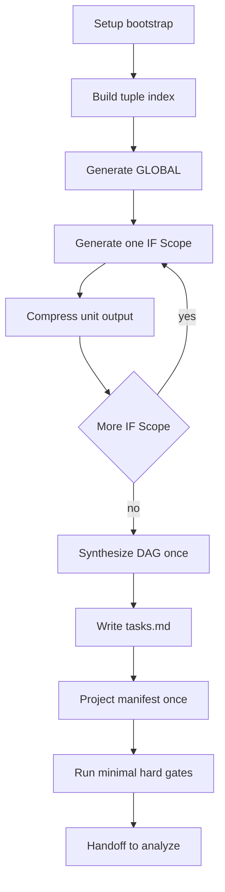

# `/sdd.tasks` 运行时优化方案

## 目标

将 [`/sdd.tasks`](../templates/commands/tasks.md) 从 `重生成 + 重约束 + 混合校验` 调整为：

- 主线只负责执行映射生成
- 非主线校验职责垂直迁移到 [`/sdd.analyze`](../templates/commands/analyze.md)
- 复用 [`/sdd.plan`](../templates/commands/plan.md) 已验证的上下文压缩与分阶段工作队列经验
- 保留 [`tasks.md`](../templates/tasks-template.md) 与 `tasks.manifest.json` 的权威/派生关系不变

---

## 现状判断

### 当前慢点来源

1. [`/sdd.tasks`](../templates/commands/tasks.md) 同时承担了：
   - 主线任务生成
   - 局部校验
   - DAG 合成
   - manifest 投影
   - 汇总报告
   - hook 前后处理

2. 它虽然已经引入了类似 [`/sdd.plan`](../templates/commands/plan.md:32) 的上下文调度思路，但仍保留过多生成时约束，尤其是：
   - 单元内反复 `Clarify -> Derive -> Validate -> Compress`
   - IF 级串行处理
   - 生成后仍做较多非执行主线的检查与汇总

3. 文档责任边界已经明确：
   - [`/sdd.tasks`](../docs/command-template-mapping.md:148) 应只做执行映射
   - [`/sdd.analyze`](../docs/command-template-mapping.md:177) 应集中承接审计与一致性分析

---

## 核心优化策略

## 策略 A：直接复用 `/sdd.plan` 的运行时工作模型

将 [`/sdd.plan`](../templates/commands/plan.md:32) 的经验原样迁移到 [`/sdd.tasks`](../templates/commands/tasks.md)，只替换“阶段”与“产物”。

### 复用点 1：三层上下文

沿用 [`Bootstrap packet / Stage workset / Unit card`](../templates/commands/plan.md:34) 结构，映射为：

- `Bootstrap packet`
  - `FEATURE_DIR`
  - 绝对路径
  - feature goal
  - 必要约束
  - artifact inventory
  - 未决 blocker

- `Generation workset`
  - 当前生成单元必需的最小 authoritative slices

- `Unit card`
  - 只允许一个活跃单元：
    - `GLOBAL foundation`
    - 单个 `IF Scope`
    - `Final DAG assembly`

### 复用点 2：固定子任务循环

把 [`Discover -> Generate -> Compress`](../templates/commands/plan.md:38) 迁移到 tasks 主线。

建议把当前 [`Clarify -> Derive -> Validate -> Compress`](../templates/commands/tasks.md:95) 改成更轻的：

- `Discover`
  - 找当前单元所需最小输入切片
- `Generate`
  - 生成该单元任务条目与局部依赖边
- `Compress`
  - 只保留稳定锚点、refs、target paths、dependency edges、blockers

其中 `Validate` 不再作为普遍主循环步骤，只保留“执行安全硬门禁”。

### 复用点 3：完成即压缩，不保留全量上下文

严格复用 [`/sdd.plan`](../templates/commands/plan.md:41) 与 [`/sdd.plan`](../templates/commands/plan.md:48) 的经验：

- 一个 `IF Scope` 完成后，只保留：
  - `IF Scope`
  - `Operation ID`
  - `Boundary Anchor`
  - task ids
  - local dependency edges
  - completion anchors
  - blockers
- 不再把完整 contract/detail/test prose 留在活动上下文中

---

## 策略 B：将非主线职责迁移出 `/sdd.tasks`

## `/sdd.tasks` 保留的职责

只保留“生成必须做”的内容：

1. 输入存在性检查
2. 当前单元的最小 authoritative slice 读取
3. `GLOBAL` 与单个 `IF Scope` 的任务生成
4. 局部 predecessor edge 提取
5. 全局 `Task DAG` 合成
6. [`tasks.md`](../templates/tasks-template.md) 写出
7. `tasks.manifest.json` 同步投影
8. 仅保留 execution-safe 级别校验

## 从 `/sdd.tasks` 迁出的职责

以下内容应迁移到 [`/sdd.analyze`](../templates/commands/analyze.md) 或保持在那里，不再由 [`/sdd.tasks`](../templates/commands/tasks.md) 承担：

- 覆盖率盘点
- requirements 到 tasks 的全面映射质量分析
- NFR 覆盖缺口分析
- 术语漂移
- helper-doc / repo-anchor 误用
- audit payload leakage
- cross-artifact contradiction sweep
- ambiguity / underspecification 扫描
- 非阻塞级 hygiene 检查

这与 [`/sdd.analyze` owns comprehensive implementation-readiness analysis](../templates/commands/analyze.md:25) 和 [`audit concerns are centralized`](../docs/command-template-mapping.md:187) 完全一致。

---

## 策略 C：把 `Validate` 缩成硬门禁，而不是综合审计

建议将 [`/sdd.tasks`](../templates/commands/tasks.md) 内的 `Validate` 重定义为“局部执行安全检查”，只包括：

### 允许保留在 `/sdd.tasks` 的检查

- 必需输入是否存在
- 当前 `IF Scope` 是否能完成 tuple 对齐
- 当前任务行是否具备可执行目标
- predecessor edge 是否可解析
- 最终 DAG 是否有明显环/缺前驱
- manifest 与 `tasks.md` task id 是否一致

### 不应继续留在 `/sdd.tasks` 的检查

- requirement coverage completeness
- ambiguity quality sweep
- terminology consistency sweep
- audit hygiene cleanup
- repo-anchor misuse general audit
- forward leakage observation beyond local blocking impact

原则：

- `tasks` 只做 `can generate and schedule safely`
- `analyze` 才做 `is semantically complete and cross-artifact clean`

---

## 策略 D：引入轻量派生缓存，但不改变权威模型

依据 [`derived views may speed retrieval or navigation`](../docs/command-template-mapping.md:39)，可增加运行时派生视图，但不落地为新的语义源。

### 推荐的临时派生结构

1. `tuple-index`
   - key: `Operation ID + Boundary Anchor + IF Scope`
   - value: contract path, detail path, TM/TC refs

2. `global-anchor-summary`
   - 从 `data-model.md` 提取跨接口共享对象与 invariant anchors

3. `unit-task-cards`
   - 每个 `IF Scope` 的压缩结果

4. `dag-seed`
   - unit-local predecessor edges 汇总结果

这些都应视为内存态 derived views，不写成新的持久化主产物。

---

## 参考改造后的执行流

---

## 推荐变更清单

### 变更 1：重写 `/sdd.tasks` 的 Outline

参考 [`/sdd.plan`](../templates/commands/plan.md:42) 的结构，把 [`/sdd.tasks`](../templates/commands/tasks.md) 改成：

1. Setup
2. Bootstrap shared context only
3. Build runtime work queue before generation
4. Execute generation loop as context-minimized workflow
5. Generate `tasks.md`
6. Generate `tasks.manifest.json`
7. Run hard gates only
8. Report minimal execution summary
9. Handoff to [`/sdd.analyze`](../templates/commands/analyze.md)

### 变更 2：精简任务生成主循环

把当前的：

- `Clarify -> Derive -> Validate -> Compress`

改为：

- `Discover -> Generate -> Compress`

并在单元结束或最终收尾时做最小硬门禁校验。

### 变更 3：缩减 report 责任

[`/sdd.tasks`](../templates/commands/tasks.md:144) 的 report 建议只保留：

- 输出路径
- task 总数
- IF / GLOBAL 数量摘要
- DAG 是否可调度
- manifest 是否与 task ids 对齐
- 下一步固定建议：运行 [`/sdd.analyze`](../templates/commands/analyze.md)

去掉偏审计性质的解释性总结。

### 变更 4：明确 analyze 接管项

在 [`/sdd.tasks`](../templates/commands/tasks.md) 内新增明确声明：

- coverage completeness
- ambiguity / contradiction sweep
- terminology drift
- audit hygiene
- repo-anchor misuse

统一由 [`/sdd.analyze`](../templates/commands/analyze.md) 承接。

### 变更 5：把 hook 处理收窄为存在性和执行，不做更多解释性工作

hook 本身保留，但避免让 hook 检查扩展为额外分析流程。

---

## 风险与边界

### 风险 1：`tasks` 过度瘦身后，产物质量下滑

应对：

- 保留局部执行安全门禁
- 把 analyze-first gate 继续作为默认主线，见 [`recommended sequence`](../docs/command-template-mapping.md:60)

### 风险 2：用户跳过 `analyze`

应对：

- 保持 [`/sdd.implement`](../docs/command-template-mapping.md:161) 的 analyze-first blocking reminder
- 让 implement 只做硬门禁，不做综合审计回补

### 风险 3：临时缓存被误当成语义真源

应对：

- 在 [`/sdd.tasks`](../templates/commands/tasks.md) 里明确 derived view 失效规则
- 保持 [`tasks.manifest.json`](../docs/command-template-mapping.md:34) 仍只是 runtime projection

---

## 建议实施顺序

- 第一步：只改 [`templates/commands/tasks.md`](../templates/commands/tasks.md) 的责任边界与主循环措辞
- 第二步：同步更新 [`docs/command-template-mapping.md`](../docs/command-template-mapping.md) 中 `/sdd.tasks` 与 `/sdd.analyze` 的边界描述
- 第三步：补充或调整针对 `tasks` 运行时收敛、manifest 同步、analyze 职责承接的测试
- 第四步：如效果稳定，再考虑优化 [`scripts/bash/check-prerequisites.sh`](../scripts/bash/check-prerequisites.sh) 与 [`scripts/bash/common.sh`](../scripts/bash/common.sh) 的微小脚本开销

---

## 建议的执行 Todo

- [ ] 重构 [`/sdd.tasks`](../templates/commands/tasks.md) Outline，套用 [`/sdd.plan`](../templates/commands/plan.md) 的上下文压缩模型
- [ ] 将 `Validate` 从主循环中降级为最小 execution-safe hard gates
- [ ] 明确把 coverage、ambiguity、drift、audit hygiene、repo-anchor misuse 迁移给 [`/sdd.analyze`](../templates/commands/analyze.md)
- [ ] 精简 tasks report，只保留执行摘要与 analyze handoff
- [ ] 校对 [`docs/command-template-mapping.md`](../docs/command-template-mapping.md) 的职责声明与 gate 文案
- [ ] 增补测试，防止 `/sdd.tasks` 再次吸收非主线职责
