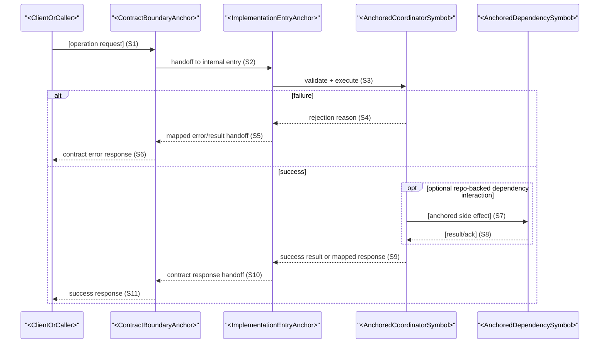
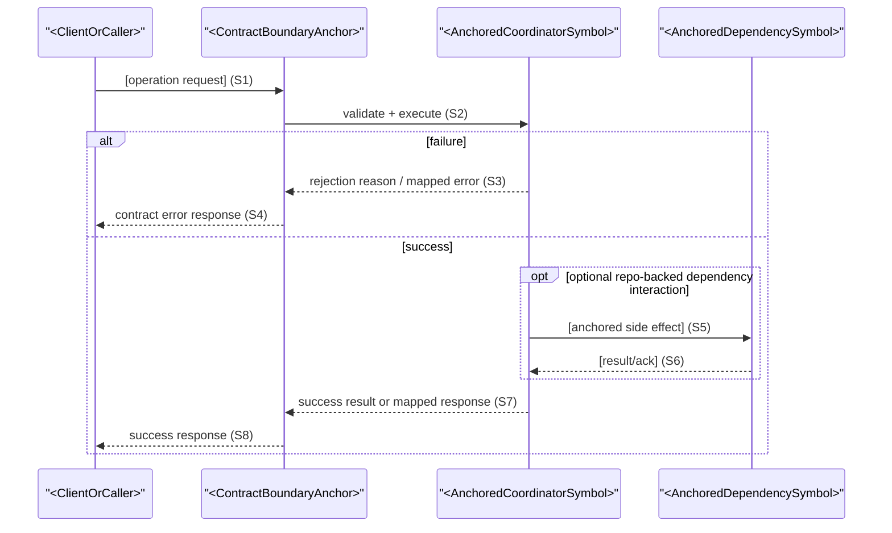
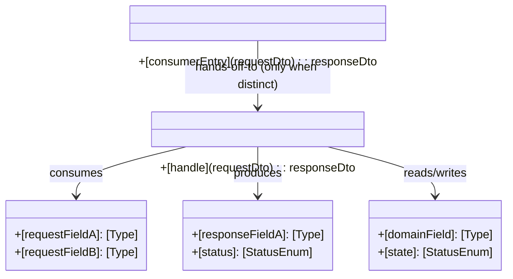
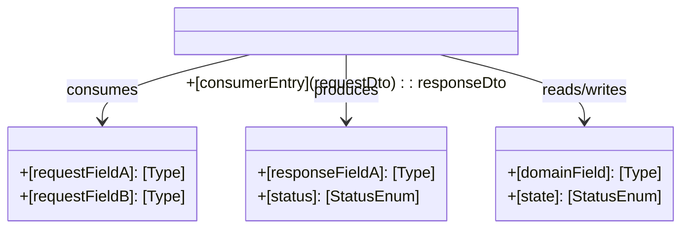

# Northbound Interface Design: [BOUNDARY OR OPERATION]

**Stage**: Stage 3/4 Unified Interface Design
**Scope**: [operation, endpoint, event, command, or external boundary]
**IF Scope (Required)**: [IF-### or N/A]
**Operation ID (Required)**: [operationId or N/A]
**Test Scope (Required)**: [`Contract` \| `Integration` \| `E2E` \| `Mixed`]
**Boundary Anchor (Required)**: [HTTP `METHOD /path` \| `event.topic` \| `Facade.method` \| `cli command` \| `N/A`]
**Anchor Status (Required)**: [`existing` \| `extended` \| `new` \| `todo`]
**Implementation Entry Anchor (Required)**: [repo-backed internal handoff entry such as `Controller.method` or `Facade.method`]
**Implementation Entry Anchor Status (Required)**: [`existing` \| `extended` \| `new` \| `todo`]

This unified artifact is the single authoritative interface design unit for one binding row.
It combines:

- `Northbound Minimal Contract` (UIF + necessary UDD only)
- `Contract Realization Design` (delivery-level internal design needed for implementation and verification)

## Northbound Entry Rules (Normative)

- Allowed normative boundary-anchor forms are exactly: HTTP `METHOD /path`, event topic `event.topic`, RPC/Façade method `Facade.method`, CLI `command`, or explicit `N/A`.
- `Boundary Anchor` MUST represent the first client-callable entry for this interaction, not an internal service/manager/mapper hop.
- If clients call an HTTP route directly, prefer HTTP `METHOD /path` as `Boundary Anchor`; do not skip to internal layers.
- If clients call a stable RPC/Façade surface, use repo-backed `Facade.method` as `Boundary Anchor`.
- If both controller/HTTP and façade exist, select the consumer-visible first callable entry as normative `Boundary Anchor`.
- `BA-*` labels are not valid normative boundary anchors. If used, treat them as local shorthand notes only and never as authoritative binding keys.
- Apply repo-anchor decision order `existing -> extended -> new -> todo`.
- `extended` is valid only for same-entity field/state expansion.
- `new` is normative only when explicit `path::symbol` target evidence is provided.
- If explicit target evidence is missing, set corresponding anchor field to `TODO(REPO_ANCHOR)` and status to `todo`; treat that tuple as non-normative forward-looking only.

## Contract Binding

- Use this section for binding rationale and dependency notes only.
- Canonical tuple fields (`Operation ID`, `Boundary Anchor`, `IF Scope`, anchor statuses, repo anchors) MUST be recorded once in `Minimal Binding References`; do not duplicate the tuple column set here.
- Visible consumer / caller: [actor or system]
- Client entry rationale: [why this `Boundary Anchor` is the first consumer-callable entry]
- Entry-anchor rationale: [why this realization entry is required; if equal to boundary, state that explicitly]
- Southbound dependencies: [repo-backed downstream calls/infrastructure dependencies that affect behavior/outputs/failures]

## Minimal Binding References

Use stable IDs and short references only. Keep this section focused on the minimum downstream binding required for execution mapping.

| Operation ID | Boundary Anchor | Operation / Interaction | IF Scope | Anchor Status | Repo Anchor | Implementation Entry Anchor | Implementation Entry Status | Upstream Ref(s) | Data Model Ref(s) |
|--------------|-----------------|-------------------------|----------|---------------|-------------|-----------------------------|-----------------------------|-----------------|-------------------|
| [operationId or N/A] | [HTTP `METHOD /path` / `event.topic` / `Facade.method` / `cli command` / `N/A`] | [name] | [IF-### or N/A] | [`existing` / `extended` / `new` / `todo`] | [`path/to/file.ext::Symbol` or `TODO(REPO_ANCHOR)`] | [`path/to/file.ext::Symbol` or `TODO(REPO_ANCHOR)`] | [`existing` / `extended` / `new` / `todo`] | [UC/FR/UIF/TM/TC refs needed downstream] | [Entity / INV / Lifecycle anchor ref] |

## Downstream Projection Input (Required)

This section is the normalized downstream input slice for `/sdd.tasks` and `/sdd.implement`.
Do not repeat full prose from `spec.md` or `test-matrix.md`; project only execution-relevant keys and pass/fail anchors.

### Spec Projection Slice

| IF Scope | Operation ID | UC Ref(s) | UIF Ref(s) | FR Ref(s) | Scenario Ref(s) | Success Criteria Ref(s) | Edge Case Ref(s) |
|----------|--------------|-----------|------------|-----------|-----------------|-------------------------|------------------|
| [IF-### or N/A] | [operationId or N/A] | [UC-###] | [UIF-###] | [FR-###] | [SC-### / UC scenario id] | [N.1 / SC anchor refs] | [N.2 / EC anchor refs] |

### Test Projection Slice

| IF Scope | Operation ID | Test Scope | TM ID | TC ID(s) | Main Pass Anchor | Branch/Failure Anchor(s) | Command / Assertion Signal |
|----------|--------------|------------|-------|----------|------------------|--------------------------|----------------------------|
| [IF-### or N/A] | [operationId or N/A] | [`Contract` / `Integration` / `E2E` / `Mixed`] | [TM-###] | [TC-###, TC-###] | [primary success check] | [failure/branch checks] | [test command or assertion signal] |

## Northbound Minimal Contract

This section is contract-minimal by design. It is **not** an exhaustive request/response field handbook.
Use only the necessary `UIF` + `UDD` slice required for implementation/verification closure.

### External I/O Summary

Read the anchored client-entry signature surface (HTTP route/controller or façade/RPC method) and anchored request/response DTO first.
Request / Success Output / Failure Output MUST align with that anchored signature and DTO structure, including field names, nesting, and status vocabulary. Do not flatten, rename, split, or otherwise reshape anchored external I/O.

| Aspect | Definition |
|--------|------------|
| Request / Input (Necessary UDD Slice) | [Only behavior-significant and verification-significant external inputs] |
| Success Output (Necessary UDD Slice) | [Only behavior-significant external success fields/effects] |
| Failure Output (Necessary UDD Slice) | [Only behavior-significant external failure fields/effects] |

### Preconditions

- [Condition that must hold before the interaction]

### Postconditions

- [State or guarantee after successful completion]

### Success Semantics

- [What success means externally]

### Failure Semantics

- [Contract-visible failure mode]

### Visible Side Effects

- [Externally visible state change, event, or notification]

## Contract Realization Design

### Field Semantics

List only fields that affect contract-visible behavior, validation, authorization, projection, or state transitions.
If anchored signature surface and request/response DTOs exist, preserve that shape (field names, nesting, enum/status vocabulary).
Field semantics may add business meaning, but must not rename anchored fields, flatten nesting, split anchored fields into new fields, or add non-anchored flow-only fields.

| Field | Direction | Meaning | Required / Optional | Rules | Source |
|-------|-----------|---------|---------------------|-------|--------|
| [field] | [input / output / state] | [semantic meaning] | [required / optional] | [validation, invariant, projection, or mapping rule] | [contract/model/repo ref] |

### Behavior Paths

Keep only materially distinct paths. Merge paths that differ only in internal mechanics when the trigger, contract-visible outcome, and failure semantics are the same.

| Path | Trigger | Key Steps | Outcome | Contract-Visible Failure | Sequence Ref | TM/TC Anchor |
|------|---------|-----------|---------|--------------------------|--------------|--------------|
| Main | [Trigger] | [Essential interaction steps] | [Success outcome] | [N/A or failure mode] | [S1] | [TM-### / TC-###] |

### Sequence Diagram

Sequence MUST start from consumer/client entry and reach `Implementation Entry Anchor` within the first two request hops.
Sequence MUST be an end-to-end contiguous chain at this document's declared granularity: no broken hops, no orphan participants, and no disconnected request/response segments.
Each `Behavior Paths` row MUST map to one contiguous ordered step chain from trigger entry to contract-visible outcome/failure.
If both controller and facade exist for this operation, show both participants in order with explicit handoff.
If `Boundary Anchor` and `Implementation Entry Anchor` differ, render **Sequence Variant A** and show both forward and return handoff messages explicitly.
If `Boundary Anchor` and `Implementation Entry Anchor` resolve to the same repo-backed symbol, render **Sequence Variant B only**. In that case, MUST NOT declare a separate `Entry` participant or any boundary-to-entry handoff message.

#### Sequence Variant A (Boundary != Entry)

#### Sequence Variant B (Boundary == Entry)

### UML Class Design

UML participants MUST cover all classes/interfaces that appear as executable participants in the sequence diagram at this document granularity.
Every sequence call that invokes a class/interface operation MUST be represented by a named method on an owning UML class/interface with a directed relationship.
Any newly introduced field/method/call (not already in anchored sources) MUST be explicitly marked as new and connected to both caller/callee or owner/consumer.
For contract-visible request/response and behavior-significant fields, each field MUST have explicit UML ownership.
If `Boundary Anchor` and `Implementation Entry Anchor` differ, render **UML Variant A**.
If `Boundary Anchor` and `Implementation Entry Anchor` resolve to the same repo-backed symbol, render **UML Variant B only**: merge them into one UML class/interface and omit synthetic handoff relations.

#### UML Variant A (Boundary != Entry)

#### UML Variant B (Boundary == Entry)

## Runtime Correctness Check

All required rows in this section must be present; each row may remain `ok` or `gap` with explicit evidence.

| Runtime Check Item | Required Evidence | Anchor | Status |
|--------------------|-------------------|--------|--------|
| Boundary-to-entry reachability | Sequence reaches `Implementation Entry Anchor` from consumer/client entry within the first two request hops | [boundary/entry anchors + sequence steps] | [ok / gap] |
| End-to-end chain continuity | Each declared behavior path maps to one contiguous request/response step chain with no disconnected hops | [behavior path ids + sequence step chains] | [ok / gap] |
| Behavior-path closure | `Behavior Paths` trigger/outcome/failure is fully covered by `Sequence Ref` steps | [path + sequence steps + TM/TC] | [ok / gap] |
| Failure consistency | Sequence failure steps map exactly to contract `Failure Output` semantics | [failure rows] | [ok / gap] |
| State-transition legality | Every sequence step that reads/writes lifecycle state maps to a valid lifecycle transition and invariant | [data-model lifecycle + INV-*] | [ok / gap] |
| Message callability | Every contract-visible sequence message maps to a callable boundary/collaborator operation with UML ownership | [entry surface/DTO + UML operation/responsibility] | [ok / gap] |
| Field-ownership closure | Every contract-visible request/response field and every behavior-significant `Field Semantics` row has an explicit owning UML class/interface | [contract I/O + field semantics + UML ownership] | [ok / gap] |
| Sequence-participant UML closure | Every executable sequence participant appears as a UML class/interface with at least one mapped operation | [sequence participants + UML class/method refs] | [ok / gap] |
| New-field/method call linkage | Every new field/method/call introduced in this document is explicitly marked and connected by ownership/call relationships | [new markers + UML relationships + sequence calls] | [ok / gap] |

## Upstream References

- `spec.md`: [canonical source for UC / FR / UIF refs]
- `test-matrix.md`: [TM / TC refs captured above; keep tuple values aligned]
- `data-model.md`: [shared concepts, invariants, and lifecycle anchors]
- repo anchors: [boundary/entry/DTO/collaborator symbols]

## Boundary Notes

- Keep northbound contract semantics minimal (`UIF` + necessary `UDD` slice only).
- Keep realization design delivery-oriented; avoid feature-wide architecture decomposition.
- Do not use helper docs (`README.md`, `docs/**`, `specs/**`, generated artifacts) as repo semantic anchors.
- Do not turn this artifact into an audit ledger.
