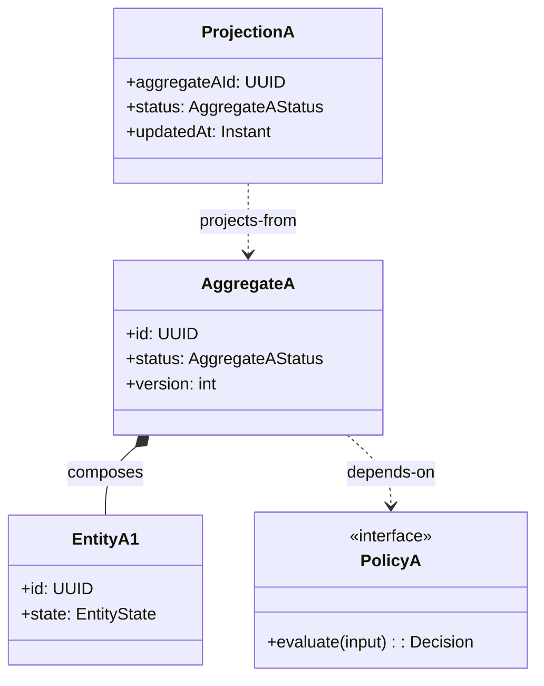

# Data Model: [FEATURE]

**Stage**: Stage 1 Data Model
**Inputs**: `spec.md`, `research.md`

Use this artifact to define the reusable global backbone model for planning outputs. It should explain what shared domain elements exist, how they relate, which rules and lifecycle anchors govern them, and what downstream authors must treat as globally stable. The content must be concrete enough to support downstream `contracts/` and `interface-details/` authoring while remaining backbone-only.

## Model Overview

Use this section to establish the overall shape of the model before filling in details.

### This file should answer

- What shared domain elements and vocabulary must remain consistent across operations
- Which globally stable fields, relationships, and derivations form the backbone model
- What cross-operation invariants and lifecycle anchors downstream artifacts must respect
- Which core classes/interfaces should appear in the backbone UML

### This file defines

- Shared domain elements and vocabulary reused across operations
- Backbone ownership/composition/projection/derivation/dependency relationships
- Cross-operation invariants in normative rule form (`INV-###`)
- Aggregate/entity lifecycle anchors needed for global semantic consistency, corrected and traced with repo anchors
- Core UML classes/interfaces with globally stable fields and labeled relationships

### This file does not define

- Full DTO field inventories or per-operation request/response payload details
- Implementation-layer decomposition (service/repository/module/class internals)
- Persistence schema/table/index mappings
- Operation-local behavior flows, sequence-level logic, or verification matrix design

## Domain Inventory

List only elements that carry shared planning semantics. Capture only globally stable fields here.
Derive semantics from `spec.md` + `research.md`; use repo anchors only for naming/lifecycle correction and traceability.

| Domain Element | Kind | Anchor Status (`existing`\|`extended`\|`new`\|`todo`) | Repo Anchor | Upstream Ref(s) | Global Responsibility | Globally Stable Fields Only |
|----------------|------|--------------------------------------------------------|-------------|-----------------|-----------------------|-----------------------------|
| `[OrderAggregate]` | `Aggregate` | `existing` | ``src/domain/order.py::OrderAggregate`` | `[spec.md#FR-001]` | [Backbone responsibility shared across operations] | `[id, customerId, status, version]` |
| `[OrderAggregate.statusHistory]` | `Aggregate Field` | `extended` | ``src/domain/order.py::OrderAggregate.statusHistory`` | `[research.md#R-001]` | [Same-entity lifecycle trace extension] | `[statusHistory]` |
| `[OrderSnapshotView]` | `Projection / View` | `new` | ``src/projection/order_snapshot.py::OrderSnapshotView`` | `[spec.md#FR-004]` | [Shared read-model responsibility] | `[orderId, state, updatedAt]` |
| `[PendingModelGap]` | `Projection / View` | `todo` | `TODO(REPO_ANCHOR)` | `[spec.md#FR-009]` | [Deferred anchor resolution] | `[deferredField]` |

## Backbone Structure

Expand the model by describing only globally significant responsibilities and links. Group by backbone domain area or subdomain.

### [Backbone Group / Subdomain A]

- **Composition**: `[AggregateA]` composes `[EntityA1, EntityA2]` because [global ownership boundary].
- **Ownership**: `[AggregateA]` owns lifecycle authority for `[EntityA1]`; external modules must not mutate `[stateField]` directly.
- **Projection**: `[ProjectionA]` is derived from `[AggregateA]` via [shared projection rule].
- **Dependency**: `[AggregateA]` depends on `[PolicyA Interface]` for [cross-operation decision semantics].

### [Backbone Group / Subdomain B]

- **Derivation**: `[DerivedValueB]` is computed from `[StableFieldX, StableFieldY]` under [global rule].
- **Association**: `[AggregateB]` references `[AggregateA]` by `[stableIdentifier]` only (no deep embedding).
- **Boundary rule**: [What can/cannot cross this group boundary at backbone level].

## Repo Anchor Decision Protocol

- Model semantics come from `spec.md` + `research.md`; repo anchors are correction/traceability evidence only.
- For every anchor decision, apply strict order: `existing -> extended -> new -> todo`.
- `extended` is valid only for same-entity field/state expansion.
- `new` is normative only when explicit `path::symbol` target evidence is provided.
- `todo` remains forward-looking and non-normative.
- `INV-*` rules and lifecycle stable states MUST NOT depend on `todo` anchors.
- Stable lifecycle states MUST align to repo-backed enum/state vocabulary when anchor status is `existing`, `extended`, or `new`.
- UI phases (page steps, flow nodes, confirmation stages) are not aggregate lifecycle states and MUST NOT be promoted into lifecycle anchors.

## Shared Invariants

Write normative rules with stable identifiers and references. Prefer rules that downstream contracts and interface details can reuse directly.

### INV-001: [Short invariant title]

- **Rule**: [Normative statement using MUST / MUST NOT / MAY]
- **Applies To**: `[Element(s) / Relationship(s)]`
- **Rationale**: [Why this is globally required]
- **Upstream Ref(s)**: `[spec.md#...], [research.md#...]`
- **Anchor Status**: `[existing | extended | new | todo]`
- **Repo Anchor(s)**: `[repo symbol if applicable]` or `TODO(REPO_ANCHOR)`

### INV-002: [Short invariant title]

- **Rule**: [Normative statement]
- **Applies To**: `[Element(s) / Relationship(s)]`
- **Rationale**: [Global semantic reason]
- **Upstream Ref(s)**: `[spec.md#...], [research.md#...]`
- **Anchor Status**: `[existing | extended | new | todo]`
- **Repo Anchor(s)**: `[repo symbol if applicable]` or `TODO(REPO_ANCHOR)`

## Lifecycle Anchors

Describe each globally shared lifecycle as its own section. Include only states and transitions that must remain stable across planning outputs.
Before writing a lifecycle section, read repo-backed enum definitions, status/state fields, and mapper status values.
Apply anchor decision order `existing -> extended -> new -> todo`.
Stable states MUST come from anchors with status `existing`, `extended`, or `new`; UI phases/page steps/flow nodes are not aggregate lifecycle states.

### Lifecycle: [Aggregate / Entity Name]

- **Anchor Status**: [`existing` | `extended` | `new` | `todo`]
- **Repo Anchor(s)**: [`path/to/file.ext::EnumOrStateField`] or `TODO(REPO_ANCHOR)`
- **State field**: `[anchored status/state field name]`
- **Stable states**: `[must match anchored enum/status vocabulary]`
- **Allowed transitions**:
  - `[Draft -> Active]` on [event/condition]
  - `[Active -> Suspended]` on [event/condition]
- **Forbidden transitions**:
  - `[Closed -> Active]` (forbidden because [global reason])
  - `[Draft -> Closed]` unless [explicit global exception]

### Lifecycle: [Second Aggregate / Entity Name]

- **Anchor Status**: [`existing` | `extended` | `new` | `todo`]
- **Repo Anchor(s)**: [`path/to/file.ext::EnumOrStateField`] or `TODO(REPO_ANCHOR)`
- **State field**: `[anchored status/state field name]`
- **Stable states**: `[must match anchored enum/status vocabulary]`
- **Allowed transitions**:
  - `[StateA -> StateB]` on [event/condition]
- **Forbidden transitions**:
  - `[StateC -> StateA]` (forbidden because [global reason])

## Backbone UML

Show core classes/interfaces plus globally stable fields and labeled relationships. Keep the diagram aligned with the sections above rather than introducing new model elements here.

## Assumptions / Open Questions

- [Capture unresolved semantic items here using `TODO(REPO_ANCHOR)` and mark as `forward-looking`; do not treat them as globally stable semantics]

## Model Closure

Use this final section to confirm that the backbone model is coherent, complete, and ready for downstream reuse.

- Ensure the model covers the shared elements, stable fields, labeled relationships, invariants, and lifecycle anchors required by `spec.md` and `research.md`.
- Ensure the content remains backbone-only and does not expand into full DTO inventories, endpoint-by-endpoint contracts, implementation layers, persistence schema design, or interface-level sequence behavior.
- Ensure terminology, invariants, and lifecycle definitions are consistent with downstream `contract-template.md` and `interface-detail-template.md` expectations without duplicating their scope.
- If anything is still uncertain, set `Anchor Status = todo` and record the gap with `TODO(REPO_ANCHOR)` in `Assumptions / Open Questions` or `Boundary Notes` rather than leaving backbone semantics ambiguous.
