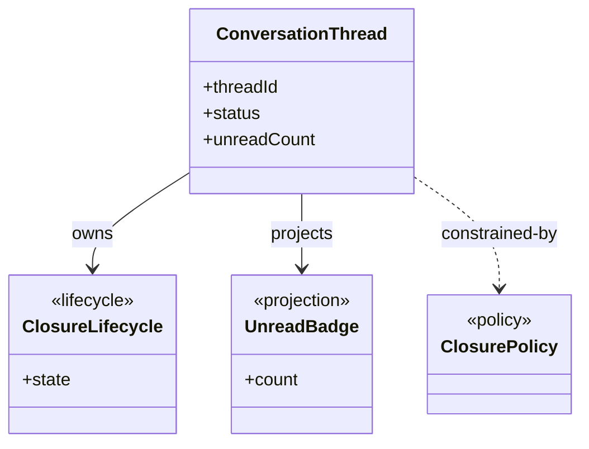
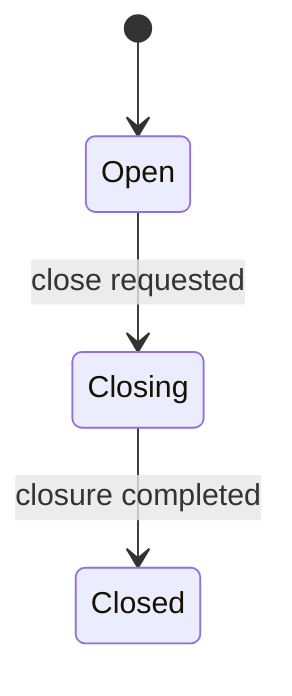

# Data Model: [FEATURE]

**Stage**: Stage 3 Shared Semantic Alignment
**Inputs**: `spec.md`, `test-matrix.md` (`Binding Contract Packets` required; `Scenario Matrix` / `Verification Case Anchors` when needed)

Use this artifact to align the shared semantic backbone consumed by multiple `BindingRowID` values. This file is authoritative for shared semantic elements and downstream reuse constraints. It is not an interface predesign artifact.

## Alignment Scope

### This file should answer

- Which user-visible data semantics are shared across bindings instead of being owned by one interface contract
- Which entities, value objects, projections, lifecycle semantics, invariants, and policies need stable naming and ownership
- Which owner/source/lifecycle decisions downstream `contract` runs must reuse instead of reinventing
- Which `BindingRowID` values consume each shared semantic element

### This file defines

- Shared semantic elements that are stable and reusable across downstream contracts
- Owner/source alignment for shared fields, projections, and derived semantics
- Shared field vocabulary at semantic level only
- Shared lifecycle and invariant vocabulary when it is reused across bindings or globally stable
- Contract-facing reuse constraints for each `BindingRowID`
- Repo-first landing decisions for any final semantic owner, lifecycle owner, or UML/class node that this artifact materializes
- Explicit `new` shared classes when `existing` and `extended` cannot safely close a confirmed shared semantic

### This file does not define

- HTTP routes, controller/service/facade naming, or repository interface placement
- Full request/response field dictionaries
- Operation-scoped DTO/command/result models
- Single-binding local validation details
- Realization-level collaborator chains or sequence design

Landing rule:

- `spec.md` + `test-matrix.md` define the shared semantics to align.
- Repo-first (`existing -> extended -> new`) governs how any final semantic owner, lifecycle owner, or UML/class node lands in the repository-facing model.
- If `existing` and `extended` cannot safely close a confirmed shared semantic, this artifact MUST choose `new`.
- `gap` is reserved for genuine input/evidence blockers, not for unresolved ownership of an already-confirmed shared semantic.

Selection rule:

- If a semantic is used by two or more `BindingRowID` values, include it here by default.
- If a semantic is used by only one `BindingRowID`, leave it to `/sdd.plan.contract` unless it is a globally stable business object, stable projection, or stable lifecycle that downstream contracts must not redefine independently.

## Semantic Backbone Summary

Summarize the shared semantic domains fixed in this run and name the `BindingRowID` values that consume them.

| Semantic Domain | Why It Is Shared | Primary Spec / UDD Ref(s) | Consumed By BindingRowID(s) | Notes |
|-----------------|------------------|---------------------------|-----------------------------|-------|
| [Conversation closure semantics] | [Shared across feedback, summary, and thread-detail bindings] | [UDD-001, FR-004] | [BR-001, BR-003, BR-004] | [Short summary] |

## Shared Semantic Class Model

This is the primary reader view. Render the final shared classes, value objects, projections, policies, and ownership relationships as Mermaid UML.
Every class or relationship shown here MUST be backed by `Shared Semantic Elements`, owner/source closure, and repo-first landing decisions later in the document.

Rendering rules:

- Prioritize shared classes and relationships only; do not draw operation-scoped DTOs or collaborator chains.
- Every node should map to one shared semantic element or one final semantic owner/lifecycle owner chosen in this stage.
- If `existing` and `extended` are insufficient for a confirmed shared semantic, introduce the required `new` class here and close it in the supporting tables below.
- Use concise field lists that expose only globally stable semantics needed by downstream contracts.

## Shared Lifecycle State Machines

This is the second primary reader view. For every shared or globally stable lifecycle, present the state owner, stable states, and an explicit transition table before any supporting detail.
If no shared lifecycle exists, keep the section with an explicit `N/A` note instead of omitting it.

### Lifecycle Summary

| Lifecycle Ref | State Owner | Stable States | Invariant Ref(s) | Consumed By BindingRowID(s) | Required Model |
|---------------|-------------|---------------|------------------|-----------------------------|----------------|
| [LC-001] | [ConversationThread.status] | [`Open`, `Closing`, `Closed`] | [INV-001, INV-002] | [BR-002, BR-003] | [`Lightweight` or `Full FSM`] |

### State Transition Table

| Lifecycle Ref | From State | Trigger / Condition | To State | Transition Type | Notes / Invariant Ref(s) | Consumed By BindingRowID(s) |
|---------------|------------|---------------------|----------|-----------------|--------------------------|-----------------------------|
| [LC-001] | [`Open`] | [close requested] | [`Closing`] | `allowed` | [INV-001] | [BR-002, BR-003] |
| [LC-001] | [`Closing`] | [closure completed] | [`Closed`] | `allowed` | [INV-001, INV-002] | [BR-002, BR-003] |
| [LC-001] | [`Closed`] | [reopen request] | [`Open`] | `forbidden` | [INV-002] | [BR-003] |

### State Diagram

Lifecycle rules:

- Apply the constitution lifecycle policy per shared lifecycle.
- Count distinct stable states as `N`.
- Count unique effective transitions as `T`.
- If `N > 3` or `T >= 2N`, include a full FSM package: transition table, transition pseudocode, and state diagram.
- Otherwise keep the lifecycle lightweight, but still include the transition table because it is a primary reader view.
- Forbidden transitions must be explicit either in the transition table or as a compact forbidden-transition list.

## Shared Semantic Elements

This is the primary shared-semantic backbone table.

| DM ID | Kind | Name | Business Meaning | Primary UDD Ref(s) | Primary Spec Ref(s) | Consumed By BindingRowID(s) | Status |
|-------|------|------|------------------|--------------------|---------------------|-----------------------------|--------|
| DM-001 | `entity` | [ConversationThread] | [Shared user-visible thread object] | [UDD-001] | [FR-001, UIF-001] | [BR-001, BR-002] | `defined` |
| DM-002 | `projection` | [UnreadBadge] | [Shared unread-count projection] | [UDD-003] | [FR-003] | [BR-001, BR-004] | `defined` |
| DM-003 | `lifecycle` | [ClosureLifecycle] | [Stable thread closure lifecycle vocabulary] | [UDD-002] | [FR-004, FR-005] | [BR-002] | `defined` |

Rules:

- `Kind` MUST be one of `entity | value-object | projection | lifecycle | invariant | policy`.
- Keep `Status = gap` only when authoritative input or evidence is missing and the stage is blocked from closing the semantic safely.
- Do not add operation-scoped request/response types or single-binding helper concepts here.
- If a row is materialized as a final class, semantic owner, lifecycle owner, or UML node, its landing MUST follow repo-first `existing -> extended -> new`.
- Do not introduce a new design-only class when an `existing` or `extended` landing already closes the shared semantic safely.
- If a confirmed shared semantic cannot land as `existing` or `extended`, introduce the required `new` class/owner/lifecycle here instead of deferring the decision.

## Owner / Source Alignment

Use this section to decide who owns the semantic and whether it is authoritative, derived, or projected. Downstream contracts must reuse this alignment instead of inventing separate ownership.

| Semantic Ref | Owner Class / Semantic Owner | Source Type | Source Ref(s) | Consumed Field / Concept | Consumed By BindingRowID(s) | Notes |
|--------------|------------------------------|-------------|---------------|--------------------------|-----------------------------|-------|
| [DM-002] | [ConversationThread.unreadCount] | `derived` | [UDD-003, FR-003] | [Unread badge count] | [BR-001, BR-004] | [Explain derivation owner] |
| [DM-003] | [ConversationThread.status] | `authoritative` | [UDD-002, FR-004] | [Closure state] | [BR-002] | [Explain why this owner is stable] |

Rules:

- `Source Type` MUST be one of `authoritative | derived | projected`.
- Every shared projection, derivation, counter, badge, role label, or lifecycle guard MUST identify the owner class/field/state that sustains it.
- Owner/source for confirmed shared semantics MUST be closed in this stage; use `gap` only when required input/evidence is genuinely missing.
- Owner/source rows that become final semantic owners in UML/class output MUST use repo-first landing instead of floating free from the codebase.

## Shared Field Vocabulary

Define only the shared field semantics that downstream contracts must reuse. This is not a full contract field dictionary.

| Field Ref | Semantic Owner | Meaning | Primary UDD Ref(s) | Required Semantics | Null / Boundary Rule | Shared By BindingRowID(s) |
|-----------|----------------|---------|--------------------|--------------------|----------------------|---------------------------|
| [FIELD-001] | [ConversationThread.status] | [User-visible thread state] | [UDD-002] | [Must use stable closure vocabulary] | [Never null after creation] | [BR-001, BR-002] |
| [FIELD-002] | [ConversationThread.unreadCount] | [Unread badge count] | [UDD-003] | [Derived from message read state] | [Defaults to `0`] | [BR-001, BR-004] |

Rules:

- Include only fields whose semantics are shared across bindings or globally stable.
- Capture vocabulary, meaning, nullability, and boundary rules only.
- Leave complete request/response expansion to `/sdd.plan.contract`.

## Lifecycle And Invariant Support

Use this section for supporting notes that explain or justify the primary lifecycle views above.
Do not repeat the main transition table unless additional detail is necessary.

### Lifecycle Notes

- [Explain why this lifecycle is shared across the listed `BindingRowID` values]
- [Record `N`, `T`, and why the lifecycle is `Lightweight` or `Full FSM`]
- [Record any forbidden-transition rationale or business-term mapping not obvious from the transition table]

### Invariant Details

#### INV-001: [Short invariant title]

- **Rule**: [Normative statement using MUST / MUST NOT / MAY]
- **Applies To**: [DM / field / lifecycle refs]
- **Rationale**: [Why this invariant must stay shared]
- **Primary Spec / UDD Ref(s)**: [FR-004, UDD-002]
- **Consumed By BindingRowID(s)**: [BR-002, BR-003]

#### INV-002: [Short invariant title]

- **Rule**: [Normative statement]
- **Applies To**: [DM / field / lifecycle refs]
- **Rationale**: [Shared semantic reason]
- **Primary Spec / UDD Ref(s)**: [FR-005, UDD-002]
- **Consumed By BindingRowID(s)**: [BR-003]

## Downstream Contract Constraints

This is the direct handoff surface for `/sdd.plan.contract`.

| BindingRowID | Required Shared Semantic Ref(s) | Constraint Type | Contract Impact |
|--------------|---------------------------------|-----------------|-----------------|
| [BR-001] | [DM-001, FIELD-002] | `owner` | [Contract must reuse shared owner/source for unread projection instead of inventing local ownership] |
| [BR-002] | [DM-003, LC-001, INV-001] | `lifecycle` | [Contract must reuse stable closure lifecycle vocabulary and transition legality] |
| [BR-003] | [DM-002, INV-002] | `projection` | [Contract must project shared derived semantic without renaming the concept] |

Rules:

- `Constraint Type` MUST be one of `owner | source | lifecycle | invariant | projection`.
- Every `BindingRowID` that depends on a shared semantic MUST be listed here.
- Use this section to tell `/sdd.plan.contract` what must be reused, not to design the contract itself.

## Alignment Closure

- Ensure `Shared Semantic Elements` and `Downstream Contract Constraints` are both present and internally consistent.
- Ensure every shared element is backed by `UDD` / spec refs and consuming `BindingRowID` rows.
- Ensure owner/source alignment closes over every shared projection or derived semantic so downstream contracts do not invent missing owners.
- Ensure lifecycle/invariant content appears only when the vocabulary is shared or globally stable.
- Ensure any final semantic owner, lifecycle owner, or UML/class node follows repo-first landing order `existing -> extended -> new`.
- Ensure confirmed shared semantics end with a closed landing decision; when `existing` and `extended` are insufficient, materialize the required `new` class/owner/lifecycle here.
- Use `Status = gap` only when the stage is blocked by missing authoritative input or missing landing evidence, not as a fallback for unresolved ownership.
