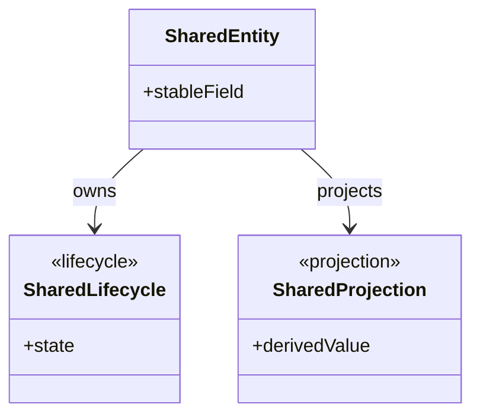
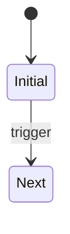

# Shared Data Model: [FEATURE NAME]

**Stage**: Stage 3 Shared Semantic Alignment

---

## Artifact Quality Signals
- Must: read like a shared business-semantic backbone.
- If a semantic is used by only one `BindingRowID`, leave it to `/sdd.plan.contract`
- Leave complete request/response expansion to `/sdd.plan.contract`.
- Use stable refs that downstream contracts can cite directly: `SSE-*`, `OSA-*`, `SFV-*`, `LC-*`, `INV-*`, and `DCC-*`.
- `contract` MUST reuse these shared refs and MUST NOT redefine shared owner/source alignment, lifecycle vocabulary, invariant vocabulary, or other confirmed shared semantics independently.
- **Prohibited**: contract-flavored/interface-role names such as `*DTO`, `*Request`, `*Response`, `*Command`, `*Result`, `*Controller`, `*Service`, or `*Facade`

---

## Shared Semantic Class Model

This is a primary reader view for shared semantic ownership and relationships.
Render only shared business-semantics classes/value objects/projections/lifecycles/policies.

Rendering rules:
- Keep only shared semantics; do not render operation-scoped DTOs/request/response/collaborator chains.
- Every node/relation MUST map to one `SSE-*` row and corresponding owner/source closure.
- If a confirmed shared semantic cannot land as `existing` or `extended`, render the required `new` class and close it in `SSE` / `OSA` / lifecycle tables.

---

## Shared Semantic Elements (SSE)

**Rules**: MUST map to `existing | extended | new | todo`. **Prohibited**: Directory-only paths.

Owner/source rules:
- Every shared projection, derivation, counter, badge, role label, or lifecycle guard MUST identify the owner class/field/state that sustains it.
- Owner/source for confirmed shared semantics MUST be closed in this stage; use `gap` only when required input/evidence is genuinely missing.
- `Anchor Status` MUST use the repo-anchor decision vocabulary `existing | extended | new | todo`; prefer `existing | extended | new` in this stage and use `todo` only for genuine evidence blockers.
- `Repo-First Strategy Evidence` MUST be explicit whenever `Anchor Status = new`; explain why `existing` and `extended` were rejected, and use `N/A` only for non-`new` rows.
- `Anchor Role` MUST align to the repo-anchor role taxonomy `owner | state-source | projection-source | carrier | partial-lineage`.
- If a confirmed shared semantic cannot land as `existing` or `extended`, introduce the required `new` class/owner/lifecycle here instead of deferring the decision.

| SSE ID | Kind | Name | Business Meaning | Primary UDD Ref(s) | Primary Spec Ref(s) | Consumed By BindingRowID(s) | Why Not Contract-Local | Anchor Status | Repo-First Strategy Evidence | Repo Anchor | Anchor Role | Status |
|---|---|---|---|---|---|---|---|---|---|---|---|---|
| SSE-001 | [entity/vo/enum/lifecycle] | [Name] | [Meaning] | [UDD] | [Spec] | [BindingRowIDs] | [Why shared] | [existing|extended|new|todo] | [N/A or rejection evidence] | `path/to/file.ext::Symbol` | [owner|state-source|projection-source|carrier|partial-lineage] | [pending|done] |

---

## Owner / Source Alignment

| OSA ID | Semantic Ref | Owner Class / Semantic Owner | Source Type | Source Ref(s) | Consumed Field / Concept | Consumed By BindingRowID(s) | Notes |
|---|---|---|---|---|---|---|---|
| OSA-001 | SSE-001 | [OwnerClass] | [repo/new] | `path/to/file.ext::Symbol` | [field/concept] | [BindingRowIDs] | [Notes] |

---

## Shared Field Vocabulary (SFV)

**Rules**: Include only globally stable fields. **Prohibited**: Trigger/request-only metadata.

| SFV ID | Semantic Owner | Meaning | Primary UDD Ref(s) | Required Semantics | Null / Boundary Rule | Shared By BindingRowID(s) |
|---|---|---|---|---|---|---|
| SFV-001 | `Entity.field` | [Meaning] | [UDD] | [Semantics] | [Null/Empty rule] | [BindingRowIDs] |

---

## Business Invariants & Lifecycle Rules

Lifecycle policy:
- Apply the constitution lifecycle policy per shared lifecycle.
- Otherwise keep the lifecycle lightweight, but still include the transition table because it is a primary reader view.

### Lifecycle Summary

| Lifecycle Ref | State Owner | Stable States | Invariant Ref(s) | Consumed By BindingRowID(s) | Required Model |
|---|---|---|---|---|---|
| LC-001 | [StateOwner] | [State list] | [INV-*] | [BindingRowIDs] | [fsm/lightweight] |

### State Transition Table

| Lifecycle Ref | From State | Trigger / Condition | To State | Transition Type | Notes / Invariant Ref(s) | Consumed By BindingRowID(s) |
|---|---|---|---|---|---|---|
| LC-001 | [from] | [trigger] | [to] | [allowed/forbidden] | [INV-* or notes] | [BindingRowIDs] |

### State Diagram (when `Required Model = fsm`)

---

## Downstream Contract Constraints

| DCC ID | BindingRowID | Required Shared Semantic Ref(s) | Constraint Type | Contract Impact |
|---|---|---|---|---|
| DCC-001 | [BindingRowID] | [SSE/SFV/LC ref] | [naming/reuse/lifecycle] | [Impact description] |
