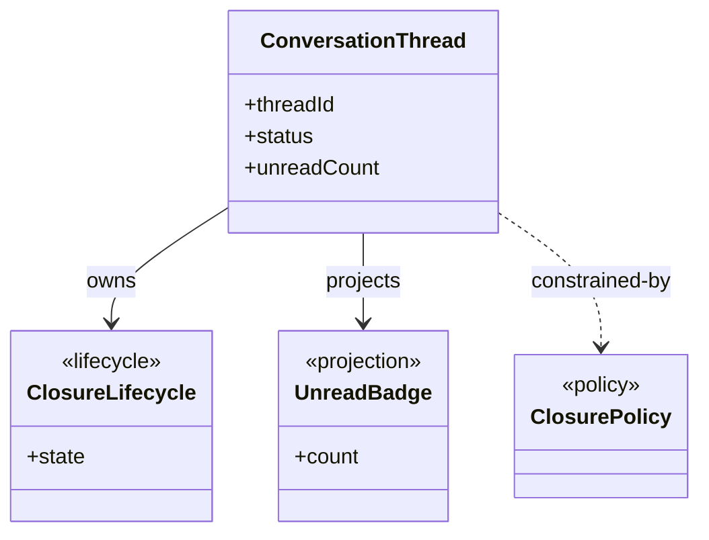
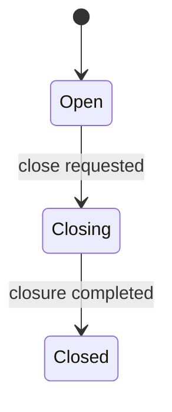

# Data Model: [FEATURE]

**Stage**: Stage 3 Shared Semantic Alignment
**Inputs**: `spec.md`, `test-matrix.md` (`Interface Partition Decisions`, `UIF Full Path Coverage Graph (Mermaid)`, `UIF Path Coverage Ledger`, `Scenario Matrix`, `Verification Case Anchors`, and `Binding Packets` required), bounded repo semantic landing slice

Use this artifact to align the shared semantic backbone consumed by multiple `BindingRowID` values. This file is authoritative for shared semantic elements and downstream reuse constraints. It is not an interface predesign artifact.

## Alignment Scope

### This file should answer

- Which user-visible data semantics are shared across bindings instead of being owned by one interface contract
- Which entities, value objects, projections, lifecycle semantics, invariants, and policies need stable naming and ownership
- Which owner/source/lifecycle decisions downstream `contract` runs must reuse instead of reinventing
- Which `BindingRowID` values consume each shared semantic element
- Which repeated interface-partition details must stay out of the shared semantic backbone even if multiple bindings mention them

### This file defines

- Shared semantic elements that are stable and reusable across downstream contracts
- Owner/source alignment for shared fields, projections, and derived semantics
- Shared field vocabulary at semantic level only
- Shared lifecycle and invariant vocabulary when it is reused across bindings or globally stable
- Contract-facing reuse constraints for each `BindingRowID`
- Repo-first landing decisions for any final semantic owner, lifecycle owner, or UML/class node that this artifact materializes
- Explicit `new` shared classes when `existing` and `extended` cannot safely close a confirmed shared semantic
- Repo-first strategy evidence for every `new` shared landing decision

### This file does not define

- HTTP routes, controller/service/facade naming, or repository interface placement
- Contract-flavored shared names such as `*DTO`, `*Request`, `*Response`, `*Command`, or `*Result`
- Full request/response field dictionaries
- Operation-scoped DTO/command/result models
- Single-binding local validation details
- Realization-level collaborator chains or sequence design
- Interface-partition-only trigger refs, request semantics, or side-effect descriptions

Landing rule:

- `spec.md` + `test-matrix.md` define the shared semantics to align.
- Repo-first (`existing -> extended -> new`) governs how any final semantic owner, lifecycle owner, or UML/class node lands in the repository-facing model.
- If `existing` and `extended` cannot safely close a confirmed shared semantic, this artifact MUST choose `new`.
- If `Anchor Status = new`, record explicit repo-first strategy evidence for why `existing` and `extended` were rejected.
- When a `new` symbol does not yet exist in the repository, prefer `Repo Anchor = TODO(REPO_ANCHOR)` instead of inventing a speculative future `path::symbol`.
- `gap` is reserved for genuine input/evidence blockers, not for unresolved ownership of an already-confirmed shared semantic.

Selection rule:

- Use `Interface Partition Decisions` first to distinguish shared business semantics from repeated interface-local details.
- Use `Binding Packets` scope reference fields (`User Intent`, `Request Semantics`, `Visible Result`, `Side Effect`, `Boundary Notes`, `Repo Landing Hint`) as exclusionary context first: they help explain why a semantic stays local or becomes shared, but they do not become shared semantics by themselves.
- If a semantic is used by two or more `BindingRowID` values, include it here only when it is business-stable across those bindings and not merely repeated trigger/request/side-effect metadata.
- If a semantic is used by only one `BindingRowID`, leave it to `/sdd.plan.contract` unless it is a globally stable business object, stable projection, or stable lifecycle that downstream contracts must not redefine independently.

## Semantic Backbone Summary

Summarize the shared semantic domains fixed in this run and name the `BindingRowID` values that consume them.

| Semantic Domain | Why It Is Shared | Primary Spec / UDD Ref(s) | Consumed By BindingRowID(s) | Notes |
|-----------------|------------------|---------------------------|-----------------------------|-------|
| [Conversation closure semantics] | [Shared across feedback, summary, and thread-detail bindings] | [UDD-001, FR-004] | [BR-001, BR-003, BR-004] | [Short summary] |

## Shared Semantic Class Model

This is the primary reader view. Render the final shared classes, value objects, projections, policies, and ownership relationships as Mermaid UML.
Every class or relationship shown here MUST be backed by `Shared Semantic Elements`, owner/source closure, and repo-first landing decisions later in the document.



Rendering rules:

- Prioritize shared classes and relationships only; do not draw operation-scoped DTOs or collaborator chains.
- Every node should map to one shared semantic element or one final semantic owner/lifecycle owner chosen in this stage.
- If `existing` and `extended` are insufficient for a confirmed shared semantic, introduce the required `new` class here and close it in the supporting tables below.
- Use concise field lists that expose only globally stable semantics needed by downstream contracts.

## Shared Lifecycle State Machines

This is the second primary reader view. For every shared or globally stable lifecycle, present the state owner, stable states, and an explicit transition table before any supporting detail.
If no shared lifecycle exists, keep the section with an explicit `N/A` note instead of omitting it.

### Lifecycle Summary

| Lifecycle Ref | State Owner | Stable States | Invariant Ref(s) | Consumed By BindingRowID(s) | Required Model |
|---------------|-------------|---------------|------------------|-----------------------------|----------------|
| [LC-001] | [ConversationThread.status] | [`Open`, `Closing`, `Closed`] | [INV-001, INV-002] | [BR-002, BR-003] | [`Lightweight` or `Full FSM`] |

### State Transition Table

| Lifecycle Ref | From State | Trigger / Condition | To State | Transition Type | Notes / Invariant Ref(s) | Consumed By BindingRowID(s) |
|---------------|------------|---------------------|----------|-----------------|--------------------------|-----------------------------|
| [LC-001] | [`Open`] | [close requested] | [`Closing`] | `allowed` | [INV-001] | [BR-002, BR-003] |
| [LC-001] | [`Closing`] | [closure completed] | [`Closed`] | `allowed` | [INV-001, INV-002] | [BR-002, BR-003] |
| [LC-001] | [`Closed`] | [reopen request] | [`Open`] | `forbidden` | [INV-002] | [BR-003] |

### Transition Pseudocode

Use this subsection when `Required Model = Full FSM`.
If the lifecycle is `Lightweight`, keep one explicit `N/A` line.

```text
if state == Open and trigger == close_requested:
    state = Closing
elif state == Closing and trigger == closure_completed:
    state = Closed
elif state == Closed and trigger == reopen_requested:
    reject("forbidden transition")
```

### State Diagram



Lifecycle rules:

- Apply the constitution lifecycle policy per shared lifecycle.
- Count distinct stable states as `N`.
- Count unique effective transitions as `T`.
- If `N > 3` or `T >= 2N`, include a full FSM package: transition table, transition pseudocode, and state diagram.
- Otherwise keep the lifecycle lightweight, but still include the transition table because it is a primary reader view.
- Forbidden transitions must be explicit either in the transition table or as a compact forbidden-transition list.

## Shared Semantic Elements

This is the primary shared-semantic backbone table.
Use stable refs that downstream contracts can cite directly: `SSE-*`, `OSA-*`, `SFV-*`, `LC-*`, `INV-*`, and `DCC-*`.

| SSE ID | Kind | Name | Business Meaning | Primary UDD Ref(s) | Primary Spec Ref(s) | Consumed By BindingRowID(s) | Why Not Contract-Local | Anchor Status | Repo-First Strategy Evidence | Repo Anchor | Anchor Role | Status |
|--------|------|------|------------------|--------------------|---------------------|-----------------------------|------------------------|---------------|------------------------------|-------------|-------------|--------|
| SSE-001 | `entity` | [ConversationThread] | [Shared user-visible thread object] | [UDD-001] | [FR-001, UIF-001] | [BR-001, BR-002] | [N/A] | `existing` | [N/A] | [`src/domain/thread.py::ConversationThread`] | `owner` | `defined` |
| SSE-002 | `projection` | [UnreadBadge] | [Shared unread-count projection] | [UDD-003] | [FR-003] | [BR-001, BR-004] | [N/A] | `extended` | [Reuse existing aggregate field and extend projection semantics in place] | [`src/domain/thread.py::ConversationThread.unreadCount`] | `projection-source` | `defined` |
| SSE-003 | `lifecycle` | [ClosureLifecycle] | [Stable thread closure lifecycle vocabulary] | [UDD-002] | [FR-004, FR-005] | [BR-002] | [Globally stable lifecycle vocabulary reused across downstream contract variants] | `existing` | [N/A] | [`src/domain/thread.py::ConversationThread.status`] | `state-source` | `defined` |

Rules:

- `Kind` MUST be one of `entity | value-object | projection | lifecycle | invariant | policy`.
- `Why Not Contract-Local` MUST be explicit for any row consumed by exactly one `BindingRowID`; use concrete cross-role/global-stability reasoning, not stylistic preference.
- `Anchor Status` MUST use the repo-anchor decision vocabulary `existing | extended | new | todo`; prefer `existing | extended | new` in this stage and use `todo` only for genuine evidence blockers.
- `Repo-First Strategy Evidence` MUST be explicit whenever `Anchor Status = new`; explain why `existing` and `extended` were rejected, and use `N/A` only for non-`new` rows.
- `Repo Anchor` MUST use strict `path/to/file.ext::Symbol` format or explicit `TODO(REPO_ANCHOR)`.
- `Anchor Role` MUST align to the repo-anchor role taxonomy `owner | state-source | projection-source | carrier | partial-lineage`.
- Keep `Status = gap` only when authoritative input or evidence is missing and the stage is blocked from closing the semantic safely.
- Do not add operation-scoped request/response types, single-binding helper concepts, or contract-flavored/interface-role names such as `*DTO`, `*Request`, `*Response`, `*Command`, `*Result`, `*Controller`, `*Service`, or `*Facade` here.
- Do not elevate trigger refs, request semantics, or side-effect descriptions from `Interface Partition Decisions` into `Shared Semantic Elements`.
- Do not elevate `User Intent`, `Visible Result`, `Boundary Notes`, or `Repo Landing Hint` from `Binding Packets` into `Shared Semantic Elements` unless they have been grounded as stable business semantics in `spec.md`.
- If a row is materialized as a final class, semantic owner, lifecycle owner, or UML node, its landing MUST follow repo-first `existing -> extended -> new`.
- Do not introduce a new design-only class when an `existing` or `extended` landing already closes the shared semantic safely.
- If a confirmed shared semantic cannot land as `existing` or `extended`, introduce the required `new` class/owner/lifecycle here instead of deferring the decision.
- When a `new` row does not yet have a real repo symbol, prefer `Repo Anchor = TODO(REPO_ANCHOR)` rather than fabricating a future anchor.

## Owner / Source Alignment

Use this section to decide who owns the semantic and whether it is authoritative, derived, or projected. Downstream contracts must reuse this alignment instead of inventing separate ownership.

| OSA ID | Semantic Ref | Owner Class / Semantic Owner | Source Type | Source Ref(s) | Consumed Field / Concept | Consumed By BindingRowID(s) | Notes |
|--------|--------------|------------------------------|-------------|---------------|--------------------------|-----------------------------|-------|
| OSA-001 | [SSE-002] | [ConversationThread.unreadCount] | `derived` | [UDD-003, FR-003] | [Unread badge count] | [BR-001, BR-004] | [Explain derivation owner] |
| OSA-002 | [SSE-003] | [ConversationThread.status] | `authoritative` | [UDD-002, FR-004] | [Closure state] | [BR-002] | [Explain why this owner is stable] |

Rules:

- `Source Type` MUST be one of `authoritative | derived | projected`.
- Every shared projection, derivation, counter, badge, role label, or lifecycle guard MUST identify the owner class/field/state that sustains it.
- Owner/source for confirmed shared semantics MUST be closed in this stage; use `gap` only when required input/evidence is genuinely missing.
- Owner/source rows that become final semantic owners in UML/class output MUST use repo-first landing instead of floating free from the codebase.
- Repeated interface-local request, trigger, or side-effect details from `test-matrix.md` are not valid owner/source rows.
- `User Intent`, `Visible Result`, `Boundary Notes`, and `Repo Landing Hint` are not valid owner/source rows by themselves.

## Shared Field Vocabulary

Define only the shared field semantics that downstream contracts must reuse. This is not a full contract field dictionary.

| SFV ID | Semantic Owner | Meaning | Primary UDD Ref(s) | Required Semantics | Null / Boundary Rule | Shared By BindingRowID(s) |
|--------|----------------|---------|--------------------|--------------------|----------------------|---------------------------|
| SFV-001 | [ConversationThread.status] | [User-visible thread state] | [UDD-002] | [Must use stable closure vocabulary] | [Never null after creation] | [BR-001, BR-002] |
| SFV-002 | [ConversationThread.unreadCount] | [Unread badge count] | [UDD-003] | [Derived from message read state] | [Defaults to `0`] | [BR-001, BR-004] |

Rules:

- Include only fields whose semantics are shared across bindings or globally stable.
- Capture vocabulary, meaning, nullability, and boundary rules only.
- Leave complete request/response expansion to `/sdd.plan.contract`.
- Do not mirror `Interface Partition Decisions` columns as vocabulary rows unless those columns point to a genuine shared business field.
- Do not mirror `Binding Packets` scope reference fields as vocabulary rows unless they point to a genuine shared business field grounded in `UDD` / spec semantics.

## Lifecycle And Invariant Support

Use this section for supporting notes that explain or justify the primary lifecycle views above.
Do not repeat the main transition table unless additional detail is necessary.

### Lifecycle Notes

- [Explain why this lifecycle is shared across the listed `BindingRowID` values]
- [Record `N`, `T`, and why the lifecycle is `Lightweight` or `Full FSM`]
- [Record any forbidden-transition rationale or business-term mapping not obvious from the transition table]

### Invariant Details

#### INV-001: [Short invariant title]

- **Rule**: [Normative statement using MUST / MUST NOT / MAY]
- **Applies To**: [SSE / SFV / LC refs]
- **Rationale**: [Why this invariant must stay shared]
- **Primary Spec / UDD Ref(s)**: [FR-004, UDD-002]
- **Consumed By BindingRowID(s)**: [BR-002, BR-003]

#### INV-002: [Short invariant title]

- **Rule**: [Normative statement]
- **Applies To**: [SSE / SFV / LC refs]
- **Rationale**: [Shared semantic reason]
- **Primary Spec / UDD Ref(s)**: [FR-005, UDD-002]
- **Consumed By BindingRowID(s)**: [BR-003]

## Downstream Contract Constraints

This is the direct handoff surface for `/sdd.plan.contract`.
`contract` MUST reuse these shared refs and MUST NOT redefine shared owner/source alignment, lifecycle vocabulary, invariant vocabulary, or other confirmed shared semantics independently.

| DCC ID | BindingRowID | Required Shared Semantic Ref(s) | Constraint Type | Contract Impact |
|--------|--------------|---------------------------------|-----------------|-----------------|
| DCC-001 | [BR-001] | [SSE-001, OSA-001, SFV-002] | `owner` | [Contract must reuse shared owner/source for unread projection instead of inventing local ownership] |
| DCC-002 | [BR-002] | [SSE-003, OSA-002, LC-001, INV-001] | `lifecycle` | [Contract must reuse stable closure lifecycle vocabulary and transition legality] |
| DCC-003 | [BR-003] | [SSE-002, OSA-001, INV-002] | `projection` | [Contract must project shared derived semantic without renaming the concept] |

Rules:

- `Constraint Type` MUST be one of `owner | source | lifecycle | invariant | projection`.
- Every `BindingRowID` that depends on a shared semantic MUST be listed here.
- Use this section to tell `/sdd.plan.contract` what must be reused, not to design the contract itself.
- Downstream `/sdd.plan.contract` output reuses these shared refs; it does not rename or redefine the shared semantic backbone chosen here.

## Alignment Closure

- Ensure `Shared Semantic Elements` and `Downstream Contract Constraints` are both present and internally consistent.
- Ensure every shared element is backed by `UDD` / spec refs and consuming `BindingRowID` rows.
- Ensure no row is included only because multiple bindings repeat the same interface-local trigger, request, or side-effect wording.
- Ensure no row is included only because packet-level scope reference fields describe similar intents, results, notes, or landing hints across bindings.
- Ensure owner/source alignment closes over every shared projection or derived semantic so downstream contracts do not invent missing owners.
- Ensure lifecycle/invariant content appears only when the vocabulary is shared or globally stable.
- Ensure any final semantic owner, lifecycle owner, or UML/class node follows repo-first landing order `existing -> extended -> new`.
- Ensure shared semantic names and UML/class nodes avoid contract-flavored/interface-role naming such as `*DTO`, `*Request`, `*Response`, `*Command`, `*Result`, `*Controller`, `*Service`, and `*Facade`.
- Ensure every `new` landing row records repo-first strategy evidence and uses `TODO(REPO_ANCHOR)` when no real repo symbol exists yet.
- Ensure confirmed shared semantics end with a closed landing decision; when `existing` and `extended` are insufficient, materialize the required `new` class/owner/lifecycle here.
- Use `Status = gap` only when the stage is blocked by missing authoritative input or missing landing evidence, not as a fallback for unresolved ownership.
