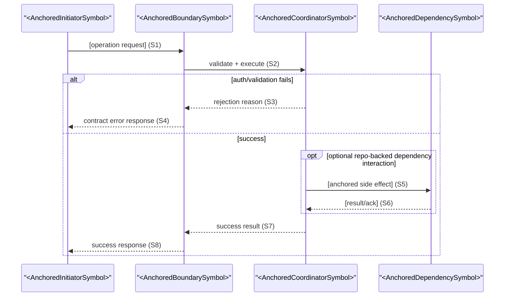
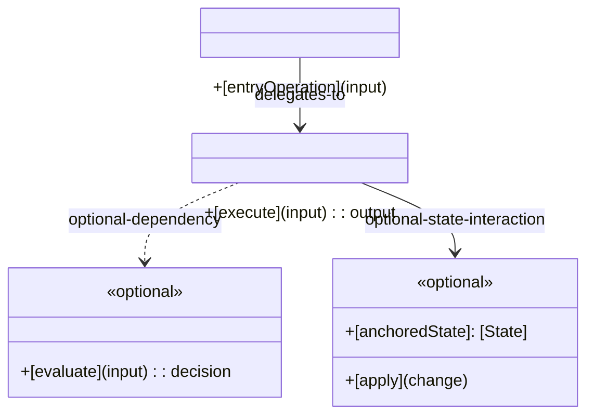

# Interface Detail: [operationId]

**Stage**: Stage 4 Interface Detailed Design
**Operation ID (Required)**: [operationId]
**IF Scope (Required)**: [IF-### or N/A]
**Boundary Anchor (Required)**: [HTTP `METHOD /path` \| `event.topic` \| `Facade.method` \| `cli command` \| `N/A`]
**Contract Artifact (Required)**: `[contracts/<artifact>]`
**Contract Binding Row (Required)**: [Operation ID + Boundary Anchor + IF Scope tuple from contract]

Contract tuple enforcement:
- `Operation ID`, `Boundary Anchor`, and `IF Scope` MUST match the Stage 3 contract binding row exactly (value and granularity).
- `Boundary Anchor` MUST be a single normative anchor value. Do not use disjunctive wording such as `A or B`.

Use one detail document per contract operation. Prefer the file name `<operationId>.md` whenever the operation has a stable identifier.
Keep this document operation-local and minimal: include only contract-visible or state-transition-relevant fields, materially distinct behavior paths, and the smallest collaborator set needed to explain the operation.

## Upstream References

- `spec.md`: [relevant FR / UC / UIF refs]
- `contracts/`: [contract artifact and operation binding; tuple must match exactly]
- `data-model.md`: [shared entities, invariants, lifecycle anchors]
- `test-matrix.md`: [TM / TC refs using the same Operation ID / Boundary Anchor / IF Scope]
- `research.md`: [constraints or reuse anchors]

## Contract Binding

- Consumer-visible interaction: [summary]
- Operation ID: [operationId; must match header and contract]
- Boundary anchor: [must match header and contract]
- IF scope: [must match header and contract]
- Participating components: [reuse anchored source-code symbols from facade method, service implementation, and manager when they exist; if no repo-backed symbol exists, use explicit forward-looking placeholders and `TODO(REPO_ANCHOR)`]
- Layered placeholder ban: when anchored symbols exist, do not invent layered collaborator placeholders or names such as `*BoundaryAdapter`, `*Service`, `*Policy`, or `*Assembler`
- Placeholder/token ban: do not use unresolved or pseudo-symbol tokens such as `AnchoredMapper`, `queryOrUpdate(...)`, or bare role labels like `Caller` as normative collaborators.

## Field Semantics

List only fields that affect contract-visible behavior, validation, authorization, projection, or state transitions. Do not restate pass-through fields that add no behavioral meaning beyond the contract.
If anchored facade/RPC method signature and DTO exist, preserve method signature surface and DTO structure (field names, nesting, and anchored enum/status vocabulary).
Field semantics may add business meaning for anchored fields, but must not rename fields, flatten nesting, split anchored fields into new fields, or add UI-confirmation-only flow fields unless those fields already exist on the anchored interface.

| Field | Direction | Meaning | Required / Optional | Rules | Source |
|-------|-----------|---------|---------------------|-------|--------|
| [field] | [input / output / state] | [semantic meaning] | [required / optional] | [validation, invariant, or projection rule] | [contract / model ref] |

## Preconditions / Postconditions

- Preconditions:
  - [Operation-local guard or prerequisite]
- Postconditions:
  - [Observable or model-level outcome]

## Behavior Paths

Keep only materially distinct paths. Merge paths that differ only in internal mechanics when the trigger, contract-visible outcome, and failure semantics are the same.

Define only the paths that matter to contract-visible outcomes. Each path should map to at least one interaction segment in the sequence diagram.

| Path | Trigger | Key Steps | Outcome | Contract-Visible Failure | Sequence Ref | TM/TC Anchor |
|------|---------|-----------|---------|--------------------------|--------------|--------------|
| Main | [Trigger] | [Essential interaction steps] | [Success outcome] | [N/A or failure mode] | [S1] | [TM-### / TC-###] |

## Sequence Diagram

Include participants and interactions whenever they influence contract-visible outcomes, key state changes, key side effects, auth/validation decisions, or critical failure paths.
Do not expand into exhaustive two-party/three-party call enumeration that has no contract-visible impact.
Use short step labels (for example `S1`, `S2`) so behavior paths can reference sequence segments.
Prefer confirmed source-code symbols for participant names.
Only when repo anchors truly do not exist may placeholders remain forward-looking; in that case mark them non-anchored/non-normative and keep `TODO(REPO_ANCHOR)` explicit.
Avoid pseudo-symbol placeholders that look callable but are not repo-anchored.
When anchored symbols exist, do not invent layered collaborator placeholders or labels (including `*BoundaryAdapter`, `*Service`, `*Policy`, `*Assembler`) from planning terminology.
Do not imply event publication paths unless a repo-backed anchor explicitly supports that path.

## UML Class Design

Use this section for an operation-level static collaboration view for this contract binding. It should complement the sequence diagram by showing which classes/interfaces hold the responsibilities behind the behavior paths and contract-visible outcomes.

- **Target artifact**: a per-operation UML class diagram focused on static collaborators for this operation only.
- **Minimum elements**:
  - key operation-local classes or interfaces represented by anchored symbols, or explicit forward-looking placeholders when repo anchors are unavailable
  - a short responsibility signal per element through class names plus only the necessary fields / operations
  - labeled relationships with type and direction where relevant such as association, dependency, composition, or realization
  - operation-local constraints or notes needed to explain validation, state change authority, emitted side effects, or failure decisions
- **Traceability**:
  - keep names consistent with the contract binding, field semantics, preconditions/postconditions, and behavior paths
  - ensure each important collaborator supports at least one sequence segment or contract-visible rule in this document
  - use this diagram to explain static responsibility placement, not to replay interaction order already covered by the sequence diagram
  - prefer source-code symbols for classes/interfaces; only when repo anchors are unavailable may forward-looking placeholders be used, and they must remain explicit non-anchored/non-normative with `TODO(REPO_ANCHOR)`
  - do not use reused planning terminology to imply a repo-backed collaborator model when no anchor exists
- **Boundary**:
  - reuse `data-model.md` entities, invariants, and lifecycle vocabulary when they apply, but do not redraw the full backbone model here
  - keep scope to the smallest set of collaborators needed to explain this operation; avoid turning this into a feature-wide domain model or implementation decomposition
- **Exclude**:
  - persistence schema, ORM/table mappings, and repository internals
  - package/module structure and deployment/component layout
  - utility/helper/cache/optimization classes with no contract-visible impact
  - language/framework-specific implementation details that do not affect operation semantics

Use placeholder names below as structure-only anchors, not implementation recommendations. Replace them with repo-backed symbols whenever such anchors exist.

## Runtime Correctness Check

Use this as an optional operation-local traceability aid during drafting. Centralized blocking validation is owned by `/sdd.analyze`.

- If an item is unresolved, keep it explicit as `TODO(REPO_ANCHOR)` and non-normative.
- `ok` means the mapping is complete and anchored; `gap` means further analysis is required before normative validation paths.

| Runtime Check Item | Required Evidence | Anchor | Status |
|--------------------|-------------------|--------|--------|
| Behavior-path closure | `Behavior Paths` trigger/outcome/failure is fully covered by `Sequence Ref` steps | [path + sequence steps + TM/TC] | [ok / gap] |
| Failure consistency | Sequence failure steps map exactly to contract `Failure Output` semantics | [contracts/<artifact> failure rows] | [ok / gap] |
| State-transition legality | Every sequence step that reads/writes lifecycle state maps to a valid lifecycle transition and invariant | [data-model lifecycle + INV-*] | [ok / gap] |
| Message callability | Every contract-visible sequence message maps to a callable boundary/collaborator operation with UML ownership | [facade/DTO + UML operation/responsibility] | [ok / gap] |

## Boundary Notes

- Reuse and extend `data-model.md` vocabulary; do not redefine global model semantics.
- You may extend data-model vocabulary, but do not invent repo-backed collaborators, DTO fields, or lifecycle states without anchoring evidence.
- If anchored facade/RPC method and DTO exist, keep method signature and DTO nesting intact across sequence, field semantics, and UML references.
- Do not recreate feature-wide verification matrices, audit ledgers, or traceability tables inside this document.
- Do not use `README.md`, `docs/**`, `specs/**`, or generated artifacts as repo anchors in this document.
