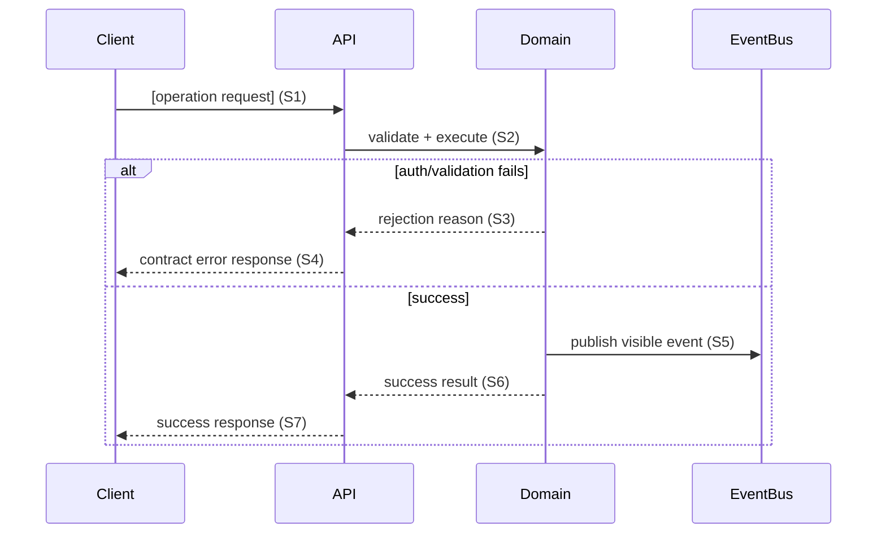
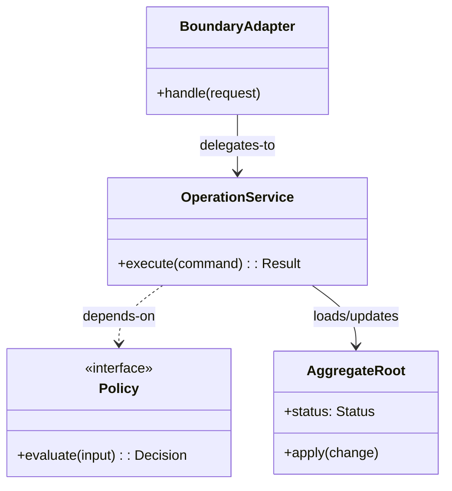

# Interface Detail: [operationId]

**Stage**: Stage 4 Interface Detailed Design
**Operation ID (Required)**: [operationId]
**IF Scope (Required)**: [IF-### or N/A]
**Boundary Anchor (Required)**: [HTTP method+path \| event topic \| RPC method \| CLI command \| N/A]
**Contract Artifact (Required)**: `[contracts/<artifact>]`
**Contract Binding Row (Required)**: [Operation ID + Boundary Anchor + IF Scope tuple from contract]

Use one detail document per contract operation. Prefer the file name `<operationId>.md` whenever the operation has a stable identifier.
Keep this document operation-local and minimal: include only contract-visible or state-transition-relevant fields, materially distinct behavior paths, and the smallest collaborator set needed to explain the operation.

## Upstream References

- `spec.md`: [relevant FR / UC / UIF refs]
- `contracts/`: [contract artifact and operation binding; tuple must match exactly]
- `data-model.md`: [shared entities, invariants, lifecycle anchors]
- `test-matrix.md`: [TM / TC refs using the same Operation ID / Boundary Anchor / IF Scope]
- `research.md`: [constraints or reuse anchors]

## Contract Binding

- Consumer-visible interaction: [summary]
- Operation ID: [operationId; must match header and contract]
- Boundary anchor: [must match header and contract]
- IF scope: [must match header and contract]
- Participating components: [confirmed repo or design anchors]

## Field Semantics

List only fields that affect contract-visible behavior, validation, authorization, projection, or state transitions. Do not restate pass-through fields that add no behavioral meaning beyond the contract.

| Field | Direction | Meaning | Required / Optional | Rules | Source |
|-------|-----------|---------|---------------------|-------|--------|
| [field] | [input / output / state] | [semantic meaning] | [required / optional] | [validation, invariant, or projection rule] | [contract / model ref] |

## Preconditions / Postconditions

- Preconditions:
  - [Operation-local guard or prerequisite]
- Postconditions:
  - [Observable or model-level outcome]

## Behavior Paths

Keep only materially distinct paths. Merge paths that differ only in internal mechanics when the trigger, contract-visible outcome, and failure semantics are the same.

Define only the paths that matter to contract-visible outcomes. Each path should map to at least one interaction segment in the sequence diagram.

| Path | Trigger | Key Steps | Outcome | Contract-Visible Failure | Sequence Ref | TM/TC Anchor |
|------|---------|-----------|---------|--------------------------|--------------|--------------|
| Main | [Trigger] | [Essential interaction steps] | [Success outcome] | [N/A or failure mode] | [S1] | [TM-### / TC-###] |

## Sequence Diagram

Include participants and interactions whenever they influence contract-visible outcomes, key state changes, key side effects, auth/validation decisions, or critical failure paths.
Do not expand into exhaustive two-party/three-party call enumeration that has no contract-visible impact.
Use short step labels (for example `S1`, `S2`) so behavior paths can reference sequence segments.

## UML Class Design

Use this section for an operation-level static collaboration view for this contract binding. It should complement the sequence diagram by showing which classes/interfaces hold the responsibilities behind the behavior paths and contract-visible outcomes.

- **Target artifact**: a per-operation UML class diagram focused on static collaborators for this operation only.
- **Minimum elements**:
  - key boundary / application / domain classes or interfaces that participate directly in the operation
  - a short responsibility signal per element through class names plus only the necessary fields / operations
  - labeled relationships with type and direction where relevant such as association, dependency, composition, or realization
  - operation-local constraints or notes needed to explain validation, state change authority, emitted side effects, or failure decisions
- **Traceability**:
  - keep names consistent with the contract binding, field semantics, preconditions/postconditions, and behavior paths
  - ensure each important collaborator supports at least one sequence segment or contract-visible rule in this document
  - use this diagram to explain static responsibility placement, not to replay interaction order already covered by the sequence diagram
- **Boundary**:
  - reuse `data-model.md` entities, invariants, and lifecycle vocabulary when they apply, but do not redraw the full backbone model here
  - keep scope to the smallest set of collaborators needed to explain this operation; avoid turning this into a feature-wide domain model or implementation decomposition
- **Exclude**:
  - persistence schema, ORM/table mappings, and repository internals
  - package/module structure and deployment/component layout
  - utility/helper/cache/optimization classes with no contract-visible impact
  - language/framework-specific implementation details that do not affect operation semantics

## Boundary Notes

- Reuse and extend `data-model.md` vocabulary; do not redefine global model semantics.
- Do not recreate feature-wide verification matrices or audit ledgers inside this document.
