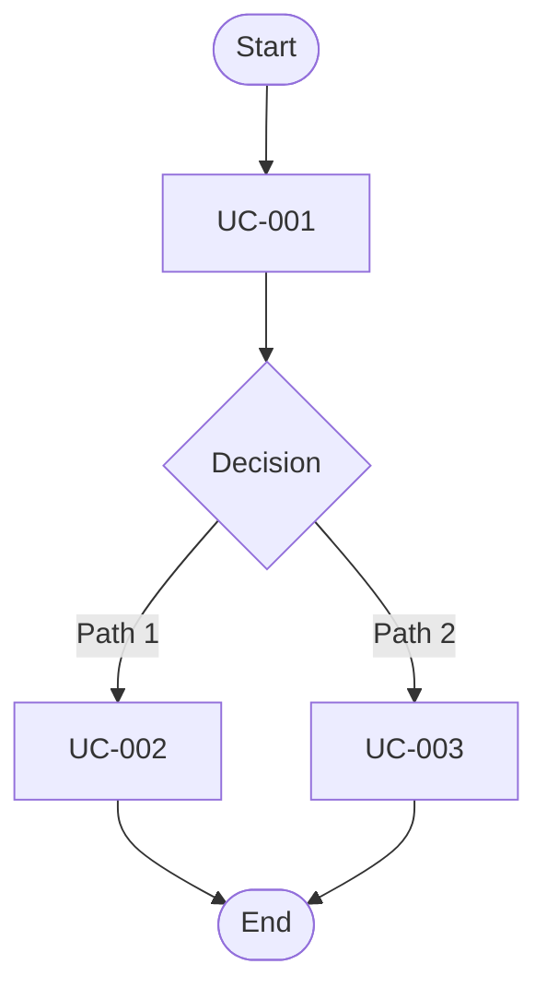
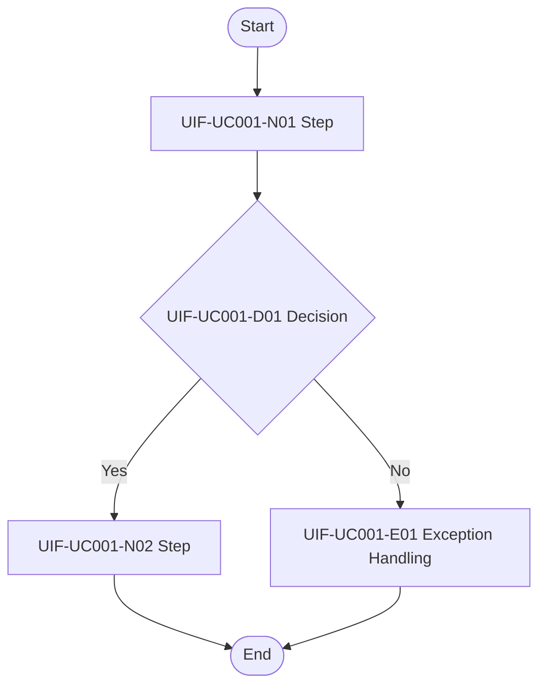

# Feature Specification: [FEATURE NAME]

**Feature Branch**: `[###-feature-name]`  
**Created**: [DATE]  
**Status**: Draft  
**Input**: User description: "$ARGUMENTS"

---

## Backbone Focus Rules *(mandatory)*

Use this document to express business/design semantics only. Keep a strict backbone-first structure and avoid governance/process noise.

- Build and maintain this backbone in order:
  1) Global business overview
  2) System/context boundaries
  3) UC set and priorities
  4) User-visible data (UDD) entities
  5) Key rules (interaction, feedback, publish/validation)
  6) Open questions only when truly blocking
- Do **not** hardcode sample project/domain names from analysis notes unless explicitly provided by user input.
- Keep examples generic and reusable across domains.
- Avoid non-essential detours in the spec body (for example: governance states, stage dispatching, coverage audits, or conversion reports).

---

## Artifacts Overview & Navigation *(mandatory)*

This section is navigation only.

### This Stage Outputs

- [spec.md](spec.md) (this document)

### Next Stages (Generated Later, as needed)

- [plan.md](plan.md) (generated by `/sdd.plan` as the planning control plane)
- Planning artifacts generated by the `sdd.plan.*` queue:
  - `research.md` via `/sdd.plan.research`
  - `data-model.md` via `/sdd.plan.data-model`
  - `test-matrix.md` via `/sdd.plan.test-matrix`
- `contracts/` via repeated `/sdd.plan.contract` (northbound contract + realization design in one artifact)
- [tasks.md](tasks.md) (generated by `/sdd.tasks`)
- [Optional checklist] Run `/sdd.checklist` when needed to generate `checklists/*.md` as vertical checklist output (not a main-flow artifact)
- [Default pre-implementation audit] Run `/sdd.analyze` after `/sdd.tasks` to review `spec.md`, `plan.md`, and `tasks.md` before `/sdd.implement`; if no current audit exists, implementation should stop unless the user explicitly waives the audit step

## § 1 Global Context *(mandatory)*

> Write this section as a true business backbone summary, not as implementation or governance commentary.

### 1.1 Actors

| Actor | Type | Permissions & Responsibilities (within this Spec) | Notes |
|-------|------|----------------------------------------------------|------|
| [Primary Actor] | Human/System | [Core responsibilities] | [Optional notes] |
| [Secondary Actor] | Human/System | [Core responsibilities] | [Optional notes] |

### 1.2 System Boundary

**In Scope**:

- [Business capability in scope]
- [Business capability in scope]

**Out of Scope**:

- [Related but explicitly excluded scope]
- [Related but explicitly excluded scope]

### 1.3 UI Data Dictionary (UDD) *(mandatory for user-visible data)*

> **Required rule**: For this template, you MUST define field-level UDD for all core user-visible entities.
> **Field completeness rule (mandatory)**: For **every** `Entity.field`, you MUST explicitly provide:
>
> 1) business rule (`Calculation / criteria`),
> 2) boundary/null rule (`Boundaries & null/empty rules`),
> 3) display rule (`Display rules`),
> 4) key path level (`Key Path`).
> Do not leave placeholders like `[TBD]`, `[same as above]`, or empty cells.

#### UDD Entity: `[EntityName]`

**Description**: [What this user-visible entity represents]  
**Notes**: [Optional scope or usage notes]

| UDD Item (Entity.field) | User-visible meaning | Calculation / criteria (business) | Boundaries & null/empty rules | Display rules | Source Type (System-backed/UI-local) | Key Path (P1/P2/P3/N/A) |
|---|---|---|---|---|---|---|
| `[EntityName.fieldA]` | [Meaning shown to user] | [Business rule] | [Boundary/null rule] | [How displayed] | [Type] | [P1/P2/P3/N/A] |
| `[EntityName.fieldB]` | [Meaning shown to user] | [Business rule] | [Boundary/null rule] | [How displayed] | [Type] | [P1/P2/P3/N/A] |

**UDD Completion Note**:

Complete each `Entity.field` row directly in the table above.
If checklist-style validation is needed, generate it separately with `/sdd.checklist` as a vertical artifact in `checklists/*.md`.

#### UDD Entity: `[EntityName2]`

**Description**: [What this user-visible entity represents]  
**Notes**: [Optional scope or usage notes]

| UDD Item (Entity.field) | User-visible meaning | Calculation / criteria (business) | Boundaries & null/empty rules | Display rules | Source Type (System-backed/UI-local) | Key Path (P1/P2/P3/N/A) |
|---|---|---|---|---|---|---|
| `[EntityName2.fieldA]` | [Meaning shown to user] | [Business rule] | [Boundary/null rule] | [How displayed] | [Type] | [P1/P2/P3/N/A] |
| `[EntityName2.fieldB]` | [Meaning shown to user] | [Business rule] | [Boundary/null rule] | [How displayed] | [Type] | [P1/P2/P3/N/A] |

---

## § 2 UC Overview *(mandatory)*

> Define the minimum UC set that closes the core user/business loop. Keep numbering consistent, but prioritize semantic completeness over numbering style.

| UC ID | Use Case Description | Primary Actor | Priority | Details |
|-------|----------------------|---------------|----------|---------|
| UC-001 | [Use case summary] | [Actor] | P1 | [Section link] |
| UC-002 | [Use case summary] | [Actor] | P1/P2 | [Section link] |

### 2.1 Functional Requirements Index (FR Index) *(mandatory)*

| UC ID | FR ID | Capability Statement (short) | Level | ref: Scenario(s) | Details |
|------|------|------------------------------|------|------------------|---------|
| UC-001 | FR-001 | [Testable capability] | MUST/SHOULD/MAY | S1, S2 | [Section link] |
| UC-001 | FR-002 | [Testable capability] | MUST/SHOULD/MAY | S2 | [Section link] |
| UC-002 | FR-001 | [Testable capability] | MUST/SHOULD/MAY | S1 | [Section link] |

### 2.2 Global UX Flow Overview *(mandatory when business flow spans multiple UCs)*

> Focus on cross-UC backbone flow only. Do not add side-track diagnostics or implementation-level branching details here.

#### Cross-UC Flow Scope

| Flow ID | Flow Goal | Involved UCs | Entry Condition | Completion Signal | ref: FR/Scenario/EC |
|--------|-----------|--------------|-----------------|-------------------|---------------------|
| GIF-001 | [Cross-UC flow goal] | UC-001, UC-002 | [Entry condition] | [Completion signal] | [Reference] |

#### Global Main / Alternate Flow

#### Global Interaction Rules

| Rule ID | Rule Type (interrupt / re-entry / cancel / timeout / permission / duplicate) | Rule Description | Applies To (UC/flow) | User-visible Outcome |
|--------|-----------------------------------------------------------------------------------|------------------|----------------------|----------------------|
| GIR-001 | timeout | [Timeout handling rule] | [Flow/UC] | [User-visible result] |
| GIR-002 | interrupt | [Interruption handling rule] | [Flow/UC] | [User-visible result] |

#### Milestones & Outcomes

| Milestone ID | Milestone Description | Ownership UC | User-visible Data Impact (`Entity.field`) | Completion Evidence |
|-------------|------------------------|--------------|-------------------------------------------|--------------------|
| GM-001 | [Milestone description] | UC-001 | `[Entity.field]` | [Evidence] |

---

## § UC-001: [Use Case Name] *(Priority: P1)*

### 3.1 User Story & Acceptance Scenarios

<!--
  Use concise, testable, business-facing language.
-->

**User Story**: As a **[actor]**, I want to **[action]**, so that **[business value]**.

**Why this priority**: [Reason this UC has this priority]

**Acceptance Scenarios**:

| # | Given (Precondition) | When (Trigger) | Then (Expected Result) |
|---|----------------------|----------------|------------------------|
| S1 | [Given] | [When] | [Then] |
| S2 | [Given] | [When] | [Then] |
| S3 (Exception) | [Given] | [When] | [Then] |

---

### 3.2 UX — User Interaction Flow *(mandatory for interactive UCs)*

**Preconditions**:

| Dimension | State Description |
|----------|-------------------|
| User State | [Precondition for user] |
| System State | [Precondition for system] |
| Data State | [Precondition for data] |

**Main Flow**:

**Path Inventory**:

| Path ID | Scenario Type (happy/alternate/exception/retry/recovery/cancel/timeout/permission/duplicate) | Start Node | End Node | Trigger / Guard | ref: Scenario/FR/EC |
|---------|---------------------------------------------------------------------------------------------------|------------|----------|-----------------|---------------------|
| UIP-UC001-01 | happy | UIF-UC001-N01 | UIF-UC001-N02 | [Guard] | S1 / FR-001 |
| UIP-UC001-02 | exception | UIF-UC001-D01 | UIF-UC001-E01 | [Guard] | S3 / FR-002 / EC-001 |

**Interaction Step Table**:

| Step ID (UIF Node) | Actor/System | Action / Feedback | Decision / Guard | Next Step(s) | ref: Entity.field / FR / Scenario |
|--------------------|--------------|-------------------|------------------|--------------|------------------------------------|
| UIF-UC001-N01 | System | [Action] | [Decision] | [Next] | `[Entity.field]` / FR-001 / S1 |
| UIF-UC001-N02 | User | [Action] | [Decision] | [Next] | `[Entity.field]` / FR-001 / S1 |

**Exception Paths**:

| Exception ID | Trigger Step | Trigger Condition | System Response | User Perception (UI Feedback) | ref |
|-------------|--------------|------------------|-----------------|-------------------------------|-----|
| E1 | [Step] | [Condition] | [Response] | [Feedback] | EC-001 |

**Postconditions**:

| Outcome | Final System State |
|---------|--------------------|
| Main flow success | [Final state] |
| Exception E1 | [Final state] |

---

### 3.3 Functional Requirements *(mandatory)*

#### FR-001 — [Requirement Name] *(Level: MUST | ref: S1, S2)*

- **Capability**: System MUST [testable business capability].
- **Given/When/Then (minimum)**:
  - **Given**: [condition]
  - **When**: [action]
  - **Then**: [outcome]
- **UDD (user-visible data) refs**:
  - **Reads/Displays**: `[Entity.field]`, `[Entity.field]`
  - **Writes/Updates**: `[Entity.field]`
- **Success criteria (testable)**:
  - [Criterion 1]
  - [Criterion 2]
- **Failure / edge behavior**:
  - [Failure behavior]

#### FR-002 — [Requirement Name] *(Level: MUST/SHOULD/MAY | ref: Sx)*

- **Capability**: System MUST/SHOULD/MAY [testable capability].
- **Given/When/Then (minimum)**:
  - **Given**: [condition]
  - **When**: [action]
  - **Then**: [outcome]
- **UDD (user-visible data) refs**:
  - **Reads/Displays**: `[Entity.field]`
  - **Writes/Updates**: `[Entity.field]`
- **Success criteria (testable)**:
  - [Criterion]

---

### 3.4 UI — UI Element Definitions *(mandatory for user-facing UCs)*

#### Page / View Info

| Item | Content |
|------|---------|
| Page Title | [Title] |
| Route Path | [Path] |
| Entry Path | [Where user comes from] |
| Access Requirements | [Role/state requirements] |

#### Component: `[component-id]`

**Type**: [List/Card/Button Group/Modal/View/etc.]

**Display Copy**:

| State | Exact Copy |
|------|------------|
| Default | "[Exact copy]" |
| Empty | "[Exact copy]" |
| Error | "[Exact copy]" |

**Meaning**: [What this component means to users]  
**Definition**: [Reference to `Entity.field` and business meaning]

**State Rules**:

| State | Trigger Condition | Visual Treatment | Interaction |
|------|-------------------|------------------|-------------|
| enabled | [Condition] | [Visual] | [Interaction] |
| disabled | [Condition] | [Visual] | [Interaction] |

**Triggered Behavior**: [What happens when user interacts; reference FR]  

---

### 3.5 Component-Data Dependency Overview *(mandatory for user-facing UCs)*

| Component ID | Dependent Data (user-perceived) | Data Source (business) | Update Trigger | ref: Entity.field | ref: FR/Scenario |
|---|---|---|---|---|---|
| `[component-id]` | [User-perceived data] | [Business source] | [Trigger] | `[Entity.field]` | FR-001 / S1 |

---

## § UC-002: [Use Case Name] *(Priority: P1/P2)*

> Repeat sections **3.1 ~ 3.5** for each UC. Keep ID namespaces unique per UC.

---

## § N Global Acceptance Criteria *(mandatory)*

### N.1 Success Criteria

- **SC-001**: [Measurable, technology-agnostic outcome]
- **SC-002**: [Measurable, technology-agnostic outcome]
- **SC-003**: [Measurable, technology-agnostic outcome]
- **SC-004**: [Measurable, technology-agnostic outcome]

### N.2 Environment Edge Cases

- **EC-001**: [Boundary/timeout/interruption edge case]
- **EC-002**: [Data empty/error edge case]
- **EC-003**: [Permission/re-entry/cancel edge case]
- **EC-004**: [Failure/degrade edge case]

---

## Assumptions / Open Questions *(optional)*

- [Assumption based on reasonable default]
- [Open question if truly critical]
