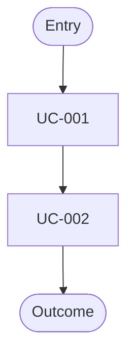
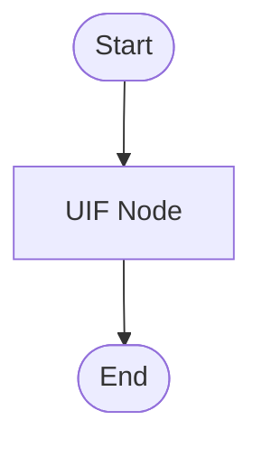

# Feature Specification: [FEATURE NAME]

**Feature Branch**: `[feature-YYYYMMDD-slug]`  
**Created**: [DATE]  
**Status**: Draft  
**Input**: "$ARGUMENTS"

---

## Artifact Quality Signals *(mandatory)*

- Must: read like a professional product/requirements artifact.
- Strictly: every section must sharpen scope, user-visible behavior, or downstream planning input.
- **Goal**: Express business/design semantics only (WHAT and WHY).
- **Prohibited**: Implementation HOW, scratchpad prose, or repeated restatements.
- **Consistency**: Keep terminology stable across UC / FR / UIF / UDD / EC.
- **Authority**: `spec.md` is the semantic Single Source of Truth for this branch.

---

## § 1 Global Context *(mandatory)*

### 1.1 Actors
| Actor | Type | Permissions & Responsibilities |
|---|---|---|
| [Actor] | Human/System | [Core responsibilities] |

### 1.2 System Boundary
- **In Scope**: [List capabilities]
- **Out of Scope**: [List exclusions]

### 1.3 UI Data Dictionary (UDD) *(mandatory)*
**Required**: MUST define field-level UDD for core entities. **Prohibited**: [TBD] or empty cells.

| UDD Item (Entity.field) | Meaning | Calculation / criteria | Boundaries & null/empty rules | Display rules | Source Type | Key Path |
|---|---|---|---|---|---|---|
| `[Entity.field]` | [Meaning] | [Business rule] | [Boundary/null] | [Display] | [Type] | [P1/P2/P3] |

---

## § 2 UC Overview *(mandatory)*
| UC ID | Description | Actor | Priority |
|---|---|---|---|
| UC-001 | [Summary] | [Actor] | P1 |

### 2.1 FR Index *(mandatory)*
| UC ID | FR ID | Capability | Level | ref: Scenario |
|---|---|---|---|---|
| UC-001 | FR-001 | [Testable capability] | MUST/SHOULD | S1 |

### 2.2 UX - Interaction Flow *(mandatory)*
**Global Main Flow (Mermaid)**:

**Global Path Inventory**:
| Path ID | Scenario Type | Start | End | Trigger / Guard | ref: UC/FR/EC |
|---|---|---|---|---|---|
| GIP-01 | happy | [Entry] | [Outcome] | [Guard] | UC-001 / FR-001 |

### 2.3 Global Interaction Rules
| Rule ID | Type (timeout/interrupt/duplicate/etc.) | Description | Applies To | Outcome |
|---|---|---|---|---|
| GIR-001 | [Type] | [Rule] | [Flow/UC] | [Result] |

---

## § 3 UC Details *(mandatory)*

### 3.1 UC-001: [Use Case Name]

#### 3.1.1 User Story & Acceptance Scenarios
**Story**: As a **[actor]**, I want to **[action]**, so that **[value]**.

| # | Given | When | Then |
|---|---|---|---|
| S1 | [Precondition] | [Trigger] | [Result] |

#### 3.1.2 UX - Interaction Flow *(mandatory)*
**Main Flow (Mermaid)**:

**Path Inventory**:
| Path ID | Scenario Type | Start | End | Trigger / Guard | ref: Scenario/FR/EC |
|---|---|---|---|---|---|
| UIP-01 | happy | [Node] | [Node] | [Guard] | S1 / FR-001 |

**Interaction Steps**:
| Step ID (UIF Node) | Action / Feedback | ref: Entity.field / FR |
|---|---|---|
| UIF-N01 | [Action] | `[Entity.field]` / FR-001 |

#### 3.1.3 Functional Requirements *(mandatory)*
##### FR-001 - [Name] *(Level: MUST | ref: S1)*
- **Capability**: System MUST [capability].
- **Given/When/Then**: [G/W/T]
- **UDD Refs**: Reads: `[Entity.field]`, Writes: `[Entity.field]`
- **Success Criteria**: [Measurable]
- **Failure / Edge Behavior**: [Behavior]

#### 3.1.4 UI Element Definitions & Dependencies
**Component**: `[id]` (Type: [Type])
| Page | Route | Access |
|---|---|---|
| [Title] | [Path] | [Role] |

| Component ID | Depends on Entity.field | Dependency Role |
|---|---|---|
| `[id]` | `[Entity.field]` | [Role] |

#### 3.1.5 Exception Paths
| Exception Path | Trigger | User-visible behavior | ref: EC |
|---|---|---|---|
| EX-001 | [Condition] | [Visible fallback/recovery behavior] | EC-001 |

---

> Repeat the same UC detail block for each additional use case under Section 3:
> `3.2 UC-002`, `3.2.1`~`3.2.5`; `3.3 UC-003`, `3.3.1`~`3.3.5`; ...
> Keep all UC details under Chapter 3. Do not promote later UCs to `§ 4`, `§ 5`, etc.

## § 4 Global Acceptance Criteria *(mandatory)*

### 4.1 Success Criteria
- **SC-001**: [Measurable, agnostic outcome]

### 4.2 Environment Edge Cases
**Authority**: `EC-*` IDs are semantic anchors. **Prohibited**: Overloading IDs for unrelated behaviors.
- **EC-001**: [Timeout/Interruption]
- **EC-002**: [Validation/Boundary]
- **EC-003**: [Duplicate/Dedupe]
- **EC-004**: [Re-entry/Recovery]
- **EC-005**: [Permission/Access]

---

## Assumptions / Open Questions
- [Truly critical items only]

---

## Next Steps

After `spec.md` is approved, generate planning artifacts in stage order:

- `research.md` via `/sdd.plan.research`
- `test-matrix.md` via `/sdd.plan.test-matrix`
- `data-model.md` via `/sdd.plan.data-model`
- `contracts/*.md` via `/sdd.plan.contract` (one per queued binding row)
- `tasks.md` via `/sdd.tasks`

Review artifacts using `/sdd.checklist` before proceeding to task generation.
